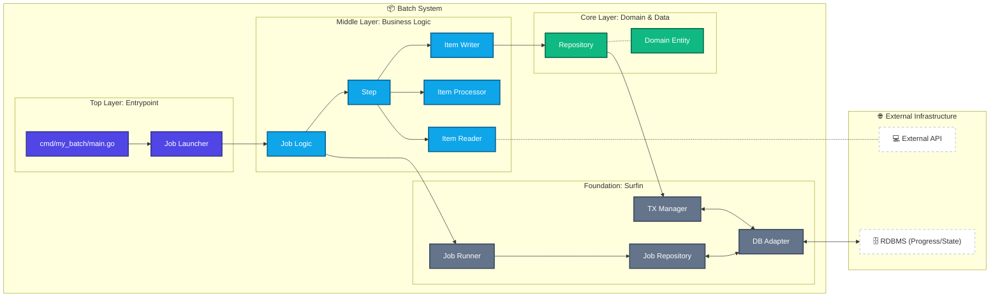

<p align="center">
  
</p>

# 🌊 Surfin - Batch framework

[](https://pkg.go.dev/github.com/tigerroll/surfin) [](https://github.com/tigerroll/surfin/blob/main/LICENSE) [](https://goreportcard.com/report/github.com/tigerroll/surfin)

[English](./README.md) | 日本語

A Cloud Native Batch framework for Go, inspired by JSR-352.

**Surfin** は、堅牢性、スケーラビリティ、および運用の容易さを最優先課題として開発されています。
<br/> バッチ処理に規律をもたらし、安全な例外処理や障害復旧を可能にするために設計された、軽量な Go 向けバッチフレームワークです。
<br/> 宣言型職務定義(JSL)とクリーンアーキテクチャにより、複雑なデータ処理タスクを効率的かつ確実に実行します。

Surfin は、大量のレコード処理に必要不可欠な再利用可能機能を提供します。これには、ロギング/トレーシング、トランザクション管理、ジョブ処理の統計情報、ジョブのリスタート、スキップ、およびリソース管理が含まれます。さらに、最適化およびパーティショニング技術を通じて、極めて大容量かつ高パフォーマンスなバッチジョブを可能にする、より高度な技術的サービスや機能も提供しています。シンプルなバッチジョブから、複雑で大容量なバッチジョブにいたるまで、このフレームワークを活用することで、非常に高い拡張性（スケーラビリティ）を持って膨大なデータ量を処理することができます。

## Restartable Batch Processing Framework for Go

もう処理が途中で中断しても、最初からやり直す必要はありません。JSR352 のナレッジを活用し、持続可能な保守運用を実現します。

### 😱 Have you ever faced these challenges ?

**もし 1 つでも心当たりがあるなら、Surfin はあなたのためのフレームワークです。**

* バッチが途中で落ちた。どこまで処理したか、誰も知らない。
* とりあえず最初から流し直した。翌朝、データが二重になっていた。
* 再実行フラグ用のテーブルを作ったが、仕様を知っているのは退職した人だけだった。
* 処理済みかどうかを判定するロジックが、バッチごとに微妙に違う。
* 「冪等にしておけばいい」と理想を説かれるが、実装コストが高すぎて断念した。
* 障害が起きるたびに、「どこから再開するか」を会議している。
* バッチの担当者が異動・退職し、設計の意図を知る人がいなくなった。

### 🎯 Use Cases

**API 連携・ETL・データ同期・レポート生成・データレイク投入など、大量データ処理に必要な運用機能を標準で提供します。**

* **SaaS データ連携**: `External API → CSV Stream → Transform → Database → Parquet → Data Lake`
* **ETL・データ基盤**: `API → Transform → Iceberg → Analytics`
* **業務システム連携**: `ERP → Batch → Data Warehouse`
* **レポート生成**: `Database → Aggregation → CSV / PDF`
* **IoT・工場データ**: `Sensor Data → Batch Processing → Parquet → Data Lake`

あなたは **「何を処理するか」** に集中してください。 **「どう安全に処理するか」** は、Surfin が担います。

## 🐹 Motivation: Why Surfin?

### 自前主義を超えて：Goで堅牢なバッチシステムを構築する

Go には「自前で書く（DIY）」という素晴らしい文化があります。しかし、バッチ処理の運用設計までゼロから発明する必要はありません。

Go バッチにも先人の思想を取り入れよう。「再実行」「チェックポイント」「トランザクション境界」といった課題は、数十年にわたってメインフレームや Java (JSR-352) の世界で解決されてきた「解かれた問題」です。

Surfin は、これらの普遍的な設計原則を Go のインターフェースで再構築したものです。実装はシンプルに、しかし設計思想は先人の知恵を借りる。それが、運用に耐えうるバッチシステムへの近道です。

**※より詳細な背景や思想については、記事『[Goバッチの思想は自前じゃなくていい](./docs/articles/batching-the-go-way-inheriting-enterprise-patterns.md)』をご覧ください。**

### 業務ロジックと運用ロジックの完全分離

Surfin の設計思想の根幹は「責務の分離」です。

```go
// 業務ロジックは、自分がバッチ処理の一部であることすら知らない
func (p *ReportProcessor) Process(ctx context.Context, item Report) (ReportRecord, error) {
    return transform(item), nil // ここには「どう加工するか」だけを書く
}
```

「どこまで処理したか」「失敗したらどうリトライするか」といった運用上の責務は、フレームワーク（Runner）が外側から包み込むように処理します。これにより、開発者は本来のビジネスロジックに集中でき、コードの保守性が劇的に向上します。

## 🚀 Getting Started with Surfin

インストールはとても簡単です。

```bash
go get github.com/tigerroll/surfin
```

👉 まずは **[Hello, World! チュートリアル](./docs/tutorial/hello-world.md)** から始めましょう。

シンプルなジョブは、最小限のYAMLだけで定義できます。

```yaml
jobs:
  - name: daily-report
    steps:
      - name: import-report
        reader:
          type: csv-stream
        processor:
          bean: transformReport
        writer:
          type: parquet
```

処理フローとビジネスロジックは分離されます。フローを変えるために Go コードを触る必要はありません。

#### より実践的なJSL（Job Specification Language）の例

ステップ間のトランジション、アイテム単位のリトライ・スキップポリシー、チャンクサイズなども、すべてYAMLで宣言できます。

```yaml
id: myJob
name: Sample Job

flow:
  start-element: extractStep
  elements:
    extractStep:
      id: extractStep
      chunk:
        reader:
          ref: myItemReader
        processor:
          ref: myItemProcessor
        writer:
          ref: myItemWriter
        chunk-size: 100
        item-retry:
          max_attempts: 3
          initial_interval: 1s
        item-skip:
          skip_limit: 10
      transitions:
        - on: COMPLETED
          to: notifyStep
        - on: FAILED
          fail: true

    notifyStep:
      id: notifyStep
      tasklet:
        ref: notifyTasklet
      transitions:
        - on: COMPLETED
          end: true
```

ジョブの構造（Job → Step → Chunk）と、フォールトトレランス（Retry/Skip）の設定が、コードを書かずに表現されています。

## 📍 Key Problems Solved

**どこまで処理したか分からない**

`JobRepository` と `ExecutionContext` が進捗をチャンク単位で永続化します。

```
Chunk #1 ✓
Chunk #2 ✓
Chunk #3 ✓
Chunk #4 ✗  ← 再実行時はここから再開
```

**二重実行が怖い**

同じジョブが二重に起動されても、片方は実行を自動的に拒否します。

**再開地点を管理したくない**

完了済みステップは自動的にスキップされます。失敗したステップだけが再実行されます。

**リトライ処理を毎回書きたくない**

ポリシーとして宣言するだけです。

```yaml
faultTolerance:
  retry:
    maxAttempts: 3
  skip:
    limit: 100
```

## ♻️ Mechanism of Resume

Surfin はチャンクのコミットごとに `ExecutionContext` を DB へ永続化します。再実行時はその位置を復元して、失敗地点から再開します。

実装者がやることは、Readerに現在位置を保存・復元するロジックを書くことだけです。

```go
// Readerが現在位置をExecutionContextに保存する
func (r *MyReader) Update(ctx context.Context, ec *model.ExecutionContext) error {
    ec.PutInt("read.offset", r.currentOffset)
    return nil
}

// 再実行時のOpenで位置を復元する
func (r *MyReader) Open(ctx context.Context, ec *model.ExecutionContext) error {
    if offset, ok := ec.GetInt("read.offset"); ok {
        r.currentOffset = offset
    }
    return nil
}
```

あとはフレームワークがすべてやります。
失敗した `JobExecution` の検出、コンテキストの復元、完了済みステップのスキップなど、複雑なロジックから解放されます。

## ⚖️ Comparison with Existing Solutions

自前で全部作ることは可能です。多くのチームがそうしています。

しかし、再実行性・障害耐性・安全な並行実行が必要になった瞬間、自前実装のコストは大きく跳ね上がります。

**「動いているけど、誰も触りたくない」バッチになる前に。**

| Feature                | Custom (Go) | JSR-352 (Java)    | Surfin (Go)   |
| ---------------------- | ----------- | ----------------- | ------------- |
| Chunk-based processing | custom      | ✅ built-in       | ✅ built-in   |
| Restartability         | custom      | ✅ built-in       | ✅ built-in   |
| Fault tolerance        | custom      | ✅ built-in       | ✅ built-in   |
| Declarative I/O        | custom      | ✅ built-in       | ✅ built-in   |
| Transaction management | custom      | ✅ built-in       | ✅ built-in   |
| Observability          | custom      | ✅ built-in       | ✅ built-in   |
| Parallel execution     | custom      | ✅ built-in       | ✅ built-in   |
| Job control            | custom      | ✅ built-in       | ✅ built-in   |
| Definition method      | code        | XML/Java Config   | ✅ YAML (JSL) |

## 🏗️ Architecture

「実行」と「進捗の永続化」が、明確に分離されています。



### Surfin の設計原則

1. **チャンク単位で区切る**: データをまとめて処理し、トランザクション境界を明確にする。
2. **状態を外部に永続化する**: `JobRepository` を通じて、障害発生時に「どこから再開するか」を管理する。
3. **再開点を明示する**: 障害発生時に0件目からではなく、前回成功した直後から再開できる防波堤を作る。

## 🛠️ Key Features

<p align="center">
  
</p>

* **📦 Chunk-based Processing**: チャンク単位の処理とチェックポイントによる進捗管理。
* **♻️ Restartability**: 失敗地点からの正確な再開。完了済みステップは自動スキップ。
* **🛡️ Fault Tolerance**: Retry・Skip・Backoff をポリシーとして宣言的に定義。
* **📋 Declarative I/O & Pipeline**: YAML (JSL) によるジョブ定義と、Reader/Writerの宣言的な分離。
* **🔄 Transaction Management**: `REQUIRED`・`REQUIRES_NEW` 等をサポートした堅牢なトランザクション管理。
* **✨ Observability**: OpenTelemetry と Prometheus をコアに統合。
* **📈 Parallel Execution**: Split・Decision・Partition による並列処理とスケーリング。
* **🔒 Job Control**: 楽観的ロックによる二重起動防止と、ジョブのライフサイクル（Start/Stop）管理。

## 📚 Documentation & Usage

* [はじめに・クイックスタート](./docs/guide/00_getting_started.md)
* [イントロダクション・基本概念](./docs/guide/01_introduction.md)
* [セットアップと JSL 定義](./docs/guide/02_setup_and_jsl.md)
* [ステップタイプとコンポーネント](./docs/guide/03_chunk_components.md)
* [フォールトトレランスとトランザクション管理](./docs/guide/04_fault_tolerance.md)
* [実装ロードマップ](./docs/strategy/roadmap.md)
* **アーキテクチャと設計原則**
    * [ビジョンと設計原則](./docs/architecture/01_vision_and_principles.md)
    * [アーキテクチャの全体像](./docs/architecture/02_architecture.md)

## 🆘 Support

質問・バグ報告・機能要望は GitHub Issues へ。

* **GitHub Issues**: [バグ報告・機能要望](https://github.com/tigerroll/surfin/issues)

## 📄 License

* MIT License.
