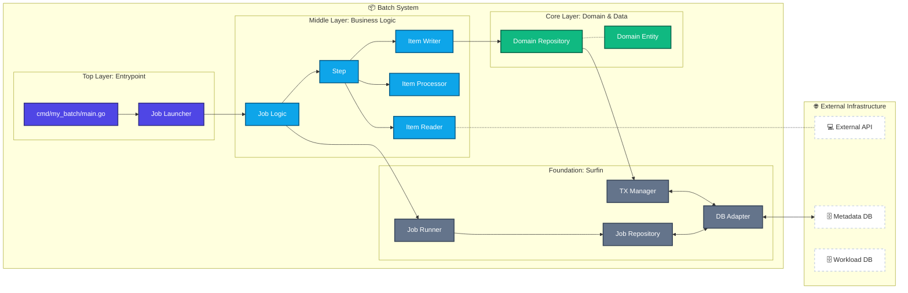

<p align="center">
  
</p>

# 🌊 Surfin - Batch framework

[](https://pkg.go.dev/github.com/tigerroll/surfin) [](https://github.com/tigerroll/surfin/blob/main/LICENSE) [](https://goreportcard.com/report/github.com/tigerroll/surfin)

[English](./README.md) | 日本語

Go向けのクラウドネイティブなバッチフレームワーク。JSR-352にインスパイアされています。

**Surfin** は、堅牢性、スケーラビリティ、および運用の容易さを最優先課題として開発されています。
<br/> バッチ処理に不可欠な実行基盤（チェックポイント、再実行可能性、フォールトトレランス、トランザクション管理、可観測性、制御された並行実行）を提供します。

宣言型ジョブ定義 (JSL) を採用することで、ビジネスロジックとバッチ実行の責務を分離し、ジョブの実行・監視・復旧のための一貫したモデルを提供します。

## Goのための再実行可能なバッチ処理フレームワーク

バッチが途中で失敗しても、最初からやり直す必要はありません。
<br/> Surfin は、JSR-352 やエンタープライズバッチ処理で培われた実行セマンティクスとアーキテクチャパターンを Go に持ち込みます。
<br/> 再実行、チェックポイント、リトライ、スキップ、障害処理をアプリケーションごとに作り直すのではなく、再利用可能なバッチインフラストラクチャとして提供します。

### 😱 こんな課題に直面したことはありませんか？

**もし 1 つでも心当たりがあるなら、Surfin はあなたのためのフレームワークです。**

* バッチが途中で落ちた。どこまで処理したか、誰も知らない。
* とりあえず最初から流し直した。翌朝、データが二重になっていた。
* 再実行フラグ用のテーブルを作ったが、仕様を知っているのは退職した人だけだった。
* 処理済みかどうかを判定するロジックが、バッチごとに微妙に違う。
* 「冪等にしておけばいい」と理想を説かれるが、実装コストが高すぎて断念した。
* 障害が起きるたびに、「どこから再開するか」を会議している。
* バッチの担当者が異動・退職し、設計の意図を知る人がいなくなった。

これらは単一のアプリケーション固有の問題ではありません。**バッチ実行セマンティクス**の問題です。
<br/> Surfin は、これらのセマンティクスを明示的かつ再利用可能なものにします。

## 🎯 ユースケース
API 連携、ETL、データ同期、レポート生成、データレイク投入など、大量データ処理に必要な運用機能を標準で提供します。

* **SaaS データ連携**: `External API → CSV Stream → Transform → Database → Parquet → Data Lake`
* **ETL・データ基盤**: `API → Transform → Iceberg → Analytics`
* **業務システム連携**: `ERP → Batch → Data Warehouse`
* **レポート生成**: `Database → Aggregation → CSV / PDF`
* **IoT・工場データ**: `Sensor Data → Batch Processing → Parquet → Data Lake`

あなたは **「何を処理するか」** に集中してください。 **「どう安全に処理するか」** は、Surfin が担います。

## 🐹 Surfin を選ぶ理由

### 自前主義を超えて：Goで堅牢なバッチシステムを構築する

Go には「自前で書く（DIY）」という素晴らしい文化があります。しかし、バッチ処理の運用設計までゼロから発明する必要はありません。

再実行、チェックポイント、トランザクション境界、リトライ、スキップ、障害処理といった課題は、数十年にわたってメインフレームや Java (JSR-352) の世界で解決されてきた「解かれた問題」です。
Surfin は、これらの普遍的な設計原則を Go のインターフェースで再構築したものです。実装は Go らしく軽量に、しかし設計思想は先人の知恵を借りる。それが、運用に耐えうるバッチシステムへの近道です。

**※より詳細な背景や思想については、記事『[Goバッチの思想は自前じゃなくていい](./docs/articles/batching-the-go-way-inheriting-enterprise-patterns.md)』をご覧ください。**

### 業務ロジックと運用ロジックの完全分離

Surfin の設計思想の根幹は「責務の分離」です。

```go
// 業務ロジックは、自分がバッチ処理の一部であることすら知らない
func (p *ReportProcessor) Process(ctx context.Context, item Report) (ReportRecord, error) {
    return transform(item), nil
}
```

Processor は「アイテムをどう処理するか」だけを記述します。

「どこまで処理したか」「失敗したらどうリトライするか」といった運用上の責務は、フレームワークが外側から包み込むように処理します。これにより、開発者は本来のビジネスロジックに集中でき、コードの保守性が劇的に向上します。

## 🚀 Surfin を始める

インストールはとても簡単です。

```bash
go get github.com/tigerroll/surfin
```

👉 まずは **[はじめに・クイックスタート](./docs/guide/00_getting_started.md)** から始めましょう。

シンプルなジョブは、最小限のYAMLだけで定義できます。

```yaml
jobs:
  - name: daily-report
    steps:
      - name: import-report
        reader:
          type: csv-stream
        processor:
          bean: transformReport
        writer:
          type: parquet
```

処理フローとビジネスロジックは分離されます。フローを変えるために Go コードを触る必要はありません。

### より実践的なJSL（Job Specification Language）の例

ステップ間のトランジション、アイテム単位のリトライ・スキップポリシー、チャンクサイズなども、すべてYAMLで宣言できます。

```yaml
id: myJob
name: Sample Job

flow:
  start-element: extractStep
  elements:
    extractStep:
      id: extractStep
      chunk:
        reader:
          ref: myItemReader
        processor:
          ref: myItemProcessor
        writer:
          ref: myItemWriter
        chunk-size: 100
        item-retry:
          max_attempts: 3
          initial_interval: 1s
        item-skip:
          skip_limit: 10
      transitions:
        - on: COMPLETED
          to: notifyStep
        - on: FAILED
          fail: true

    notifyStep:
      id: notifyStep
      tasklet:
        ref: notifyTasklet
      transitions:
        - on: COMPLETED
          end: true
```

ジョブの構造（Job → Step → Chunk）と、フォールトトレランス（Retry/Skip）の設定が、コードを書かずに表現されています。

## 📍 解決する課題

### どこまで処理したか分からない

`JobRepository` と `ExecutionContext` が進捗をチャンク単位で永続化します。

```text
Chunk #1 ✓
Chunk #2 ✓
Chunk #3 ✓
Chunk #4 ✗
```

再実行時は、前回成功した直後の位置から再開します。

### 二重実行が怖い

同じジョブが二重に起動されても、リポジトリレベルの実行制御により自動的に拒否されます。

### 再開地点を管理したくない

完了済みステップは自動的にスキップされます。失敗したステップだけが再実行されます。

### リトライ処理を毎回書きたくない

ポリシーとして宣言するだけです。

```yaml
faultTolerance:
  retry:
    maxAttempts: 3
  skip:
    limit: 100
```

## ♻️ 再実行とチェックポイント

Surfin はチャンクのコミットごとに `ExecutionContext` を DB へ永続化します。再実行時はその位置を復元して、失敗地点から再開します。
実装者がやることは、Readerに現在位置を保存・復元するロジックを書くことだけです。

```go
// Readerが現在位置をExecutionContextに保存する
func (r *MyReader) Update(ctx context.Context, ec *model.ExecutionContext) error {
    ec.PutInt("read.offset", r.currentOffset)
    return nil
}

// 再実行時のOpenで位置を復元する
func (r *MyReader) Open(ctx context.Context, ec *model.ExecutionContext) error {
    if offset, ok := ec.GetInt("read.offset"); ok {
        r.currentOffset = offset
    }
    return nil
}
```

あとはフレームワークがすべてやります。

## ⚙️ 実行セマンティクス

Surfin はバッチ実行を明示的なセマンティクスとして扱います。

```text
Execution Semantics
├── Chunk Execution
│   ├── Read
│   ├── Process
│   ├── Write
│   ├── Retry
│   ├── Skip
│   └── Checkpoint
│
└── Partition Execution
    ├── Worker
    ├── Controller
    ├── Concurrency
    ├── Partial Failure
    ├── Cancellation
    └── Restart
```

### 障害セマンティクス

本番環境のバッチシステムには「正常系」以上の対応が必要です。Surfin は実行境界を明示的に定義し、リトライ、スキップ、チェックポイント、再実行、障害処理を一つの実行モデルとして扱います。

### パーティション実行

パーティションは「処理範囲」を表す論理単位です。

```text
Partition
   │
   ├── Local Worker
   │      └── goroutine
   │
   └── Remote Worker
          └── 将来の実行モデル
```

`Partition` は何を処理するかを記述し、`Worker` はそれを実行する主体です。`Controller` は割り当て、ライフサイクル、キャンセル、結果集約を管理します。`partition.concurrency` で同時実行数を制御します。

```yaml
partition:
  concurrency: 4
```

## ⚖️ 既存ソリューションとの比較

自前で全部作ることは可能です。多くのチームがそうしています。しかし、再実行性・障害耐性・安全な並行実行が必要になった瞬間、自前実装のコストは大きく跳ね上がります。

| Feature                    | Custom (Go) | JSR-352 (Java)      | Surfin (Go)  |
| -------------------------- | ----------- | ------------------- | ------------ |
| Chunk-based processing     | custom      | ✅ built-in          | ✅ built-in   |
| Restartability             | custom      | ✅ built-in          | ✅ built-in   |
| Fault tolerance            | custom      | ✅ built-in          | ✅ built-in   |
| Declarative job definition | custom      | ✅ XML / Java Config | ✅ YAML (JSL) |
| Transaction management     | custom      | ✅ built-in          | ✅ built-in   |
| Execution metadata         | custom      | ✅ built-in          | ✅ built-in   |
| Observability integration  | custom      | ecosystem-dependent | ✅ built-in   |
| Parallel execution         | custom      | ✅ built-in          | ✅ built-in   |
| Job control                | custom      | ✅ built-in          | ✅ built-in   |

## 🏗️ アーキテクチャ


```mermaid
graph LR
    %% スタイル定義
    classDef entry fill:#4f46e5,color:#fff,stroke:#312e81,stroke-width:2px
    classDef logic fill:#0ea5e9,color:#fff,stroke:#075985,stroke-width:2px
    classDef core fill:#64748b,color:#fff,stroke:#334155,stroke-width:2px
    classDef domain fill:#10b981,color:#fff,stroke:#065f46,stroke-width:2px
    classDef cloud fill:#fff,stroke:#cbd5e1,stroke-width:2px,stroke-dasharray: 5 5

    %% 外部境界
    subgraph External ["&nbsp; 🌐 External Infrastructure &nbsp;"]
        direction LR
        HTTP["💻&nbsp;External API"]:::cloud
        MetadataDB["🗄️&nbsp;Metadata DB"]:::cloud
        WorkloadDB["🗄️&nbsp;Workload DB"]:::cloud
    end

    %% アプリケーション本体
    subgraph Application ["&nbsp; 📦 Batch System &nbsp;"]
        direction LR

        subgraph Layer_Entry ["Top Layer: Entrypoint"]
            Main["cmd/my_batch/main.go"]:::entry
            Launcher["Job Launcher"]:::entry
        end

        subgraph Layer_Logic ["Middle Layer: Business Logic"]
            direction LR
            Job["Job Logic"]:::logic
            Step["Step"]:::logic
            Reader["Item Reader"]:::logic
            Processor["Item Processor"]:::logic
            Writer["Item Writer"]:::logic
        end

        subgraph Layer_Core ["Foundation: Surfin"]
            direction LR
            Runner["Job Runner"]:::core
            Repository["Job Repository"]:::core
            TX["TX Manager"]:::core
            DB_Adapter["DB Adapter"]:::core
        end

        subgraph Layer_Domain ["Core Layer: Domain & Data"]
            direction LR
            Repo["Domain Repository"]:::domain
            Entity["Domain Entity"]:::domain
        end
    end

    %% 接続関係・実行フロー
    Main --> Launcher
    Launcher --> Job
    Job --> Step
    Step --> Reader
    Step --> Processor
    Step --> Writer

    %% フレームワーク・永続化連携
    Job --> Runner
    Runner --> Repository
    Repository <--> DB_Adapter
    DB_Adapter <--> MetadataDB

    %% 依存関係
    Writer --> Repo
    Repo --> TX
    TX <--> DB_Adapter
    Repo -.- Entity
    Reader -.- HTTP

    %% レイアウト制御
    Layer_Entry ~~~ Layer_Logic
    Layer_Logic ~~~ Layer_Core
    Layer_Core ~~~ Layer_Domain
```

### Surfin の設計原則

1. **チャンク単位で区切る (Chunking)**
   * データをまとめて処理し、トランザクション境界とチェックポイント境界を明確にする。
2. **実行状態の永続化 (Execution State)**
   * 実行メタデータを永続化し、システムが「何が完了したか」「どこから再開すべきか」を把握できるようにする。
3. **再開点の明示 (Explicit Restart Points)**
   * 再開位置をアプリケーション固有の管理項目ではなく、実行モデルの一部として扱う。
4. **制御された並行処理 (Controlled Parallelism)**
   * パーティションベースの実行と設定可能な同時実行数（concurrency）を利用し、リソース使用量を明示的に制御しながら処理をスケールさせる。
5. **責務の分離 (Separation of Concerns)**
   * ビジネスロジックを、リトライ、チェックポイント、再実行、実行制御といったバッチ実行の責務から独立させる。

<p align="center">
  
</p>

## 🛠️ 主な機能

* **📦 チャンク処理**: トランザクション境界とチェックポイント境界を明確にしたチャンク単位のデータ処理。
* **♻️ 再実行可能性**: 実行状態に基づいた再開情報の永続化と、失敗地点からの正確な再開。
* **🛡️ フォールトトレランス**: ポリシーとして宣言的に定義可能なリトライ、スキップ、バックオフ。
* **📋 宣言的ジョブ定義**: YAML (JSL) によるジョブフロー、コンポーネント、チャンクサイズ、リトライ/スキップポリシーの定義。
* **🔄 トランザクション管理**: `REQUIRED` や `REQUIRES_NEW` 伝播を含む、バッチ実行と統合されたトランザクション境界管理。
* **✨ 可観測性**: バッチ実行と運用可視化のための OpenTelemetry および Prometheus 統合。
* **📈 パーティション実行**: 設定可能な `partition.concurrency` による論理パーティションの並列実行。
* **🔒 ジョブ制御**: リポジトリレベルの実行制御とジョブライフサイクル管理。
* **💾 実行メタデータ**: ジョブ/ステップの実行状態と再開情報の永続化。
* **🧩 拡張可能なアダプター**: アダプターとインターフェースを介した、アプリケーション固有のデータベース、ストレージシステム、API、その他のインフラストラクチャとの統合。

## 📚 ドキュメントと利用方法

* [はじめに・クイックスタート](./docs/guide/00_getting_started.md)
* [イントロダクション・基本概念](./docs/guide/01_introduction.md)
* [セットアップと JSL 定義](./docs/guide/02_setup_and_jsl.md)
* [ステップタイプとコンポーネント](./docs/guide/03_chunk_components.md)
* [フォールトトレランスとトランザクション管理](./docs/guide/04_fault_tolerance.md)
* [実装ロードマップ](./docs/roadmap.md)

### アーキテクチャと設計

* [ビジョンと設計原則](./docs/architecture/01_vision_and_principles.md)
* [アーキテクチャの全体像](./docs/architecture/02_architecture.md)
* [パーティション実行設計](./docs/design/partition_execution.md)

## 🆘 サポート

質問・バグ報告・機能要望は GitHub Issues へ。

* **GitHub Issues**: [バグ報告・機能要望](https://github.com/tigerroll/surfin/issues)

## 📄 ライセンス

MIT License.
