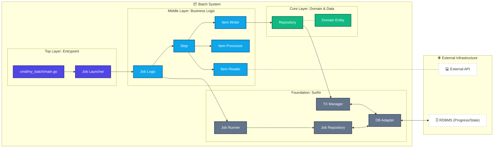

<p align="center">
  
</p>

# 🌊 Surfin - Batch framework

[](https://pkg.go.dev/github.com/tigerroll/surfin) [](https://github.com/tigerroll/surfin/blob/main/LICENSE) [](https://goreportcard.com/report/github.com/tigerroll/surfin)

English | [日本語](./README.ja.md)

A Cloud Native Batch framework for Go, inspired by JSR-352.

**Surfin** is developed with robustness, scalability, and operational ease as top priorities.
<br/> It is a lightweight batch framework for Go, designed to bring discipline to batch processing and enable safe exception handling and disaster recovery.
<br/> With declarative job definitions (JSL) and a clean architecture, it efficiently and reliably executes complex data processing tasks.

Surfin provides the reusable infrastructure that large-scale batch processing requires: logging/tracing, transaction management, job execution statistics, restart, skip, and resource management. It also offers higher-level technical services — optimization and partitioning — that enable extremely large, high-performance batch jobs. From simple jobs to large, complex ones, Surfin lets you process massive datasets with high scalability.

## Restartable Batch Processing Framework for Go

If a job fails partway through, you don't start over. Surfin brings the knowledge encoded in JSR-352 to Go, so batch systems stay maintainable over the long run.

### 😱 Have you ever faced these challenges?

**If any of these sound familiar, Surfin is for you.**

* A batch job failed midway, and nobody knew how far it had gotten.
* You reran it from the start. The next morning, the data was duplicated.
* Someone built a table to track restart flags. Whoever understood the schema has since left the company.
* The logic for "has this been processed" is slightly different in every job.
* You were told "just make it idempotent" — the implementation cost turned out to be far higher than expected.
* Every incident turns into a discussion about where it's safe to resume from.
* The person who owned the batch system moved on, and the design intent went with them.

### 🎯 Use Cases

**Surfin provides the operational primitives that large-scale data processing needs out of the box** — API integration, ETL, data sync, report generation, data lake ingestion, and more.

* **SaaS data integration**: `External API → CSV Stream → Transform → Database → Parquet → Data Lake`
* **ETL / data platform**: `API → Transform → Iceberg → Analytics`
* **Enterprise system integration**: `ERP → Batch → Data Warehouse`
* **Report generation**: `Database → Aggregation → CSV / PDF`
* **IoT / factory data**: `Sensor Data → Batch Processing → Parquet → Data Lake`

Focus on **what to process**. Surfin handles **how to process it safely**.

## 🐹 Motivation: Why Surfin?

### Beyond DIY: Building Robust Batch Systems in Go

The Go community thrives on a "DIY" (Do It Yourself) culture, and rightfully so. However, we don't need to reinvent the wheel when it comes to batch architecture.

Let's bring the wisdom of our predecessors to Go batch processing. Challenges like "restartability," "checkpoints," and "transaction boundaries" are "solved problems" that have been refined over decades in mainframe and Java (JSR-352) environments.

Surfin rebuilds these universal design principles using Go interfaces. Keep the implementation simple, but borrow the architectural wisdom of our predecessors. That is the shortcut to building production-grade batch systems.

**※For a deeper dive into the philosophy, read the article: '[Borrow the best, build the rest: Go Batch Processing](./docs/articles/batching-the-go-way-inheriting-enterprise-patterns.md)'**

### Separation of Concerns: Business logic shouldn't even know it's part of a batch process

Surfin's design philosophy is rooted in the "Separation of Concerns."

```go
// Business logic shouldn't even know it's part of a batch process
func (p *ReportProcessor) Process(ctx context.Context, item Report) (ReportRecord, error) {
    return transform(item), nil // Only write "how to process" here
}
```

Operational responsibilities—like "how far have we processed?" or "what happens if this fails?"—are handled by the framework (Runner) wrapping the logic. This allows developers to focus on business logic, dramatically improving maintainability.

## 🚀 Getting Started with Surfin

Installation is straightforward.

```bash
go get github.com/tigerroll/surfin
```

👉 Start with the **[Hello, World! tutorial](./docs/tutorial/hello-world.md)**.

A simple job needs only minimal YAML.

```yaml
jobs:
  - name: daily-report
    steps:
      - name: import-report
        reader:
          type: csv-stream
        processor:
          bean: transformReport
        writer:
          type: parquet
```

Flow and business logic are separate. Changing the flow doesn't require touching Go code.

#### A more realistic JSL (Job Specification Language) example

Transitions between steps, item-level retry/skip policies, and chunk size are all declared in YAML.

```yaml
id: myJob
name: Sample Job

flow:
  start-element: extractStep
  elements:
    extractStep:
      id: extractStep
      chunk:
        reader:
          ref: myItemReader
        processor:
          ref: myItemProcessor
        writer:
          ref: myItemWriter
        chunk-size: 100
        item-retry:
          max_attempts: 3
          initial_interval: 1s
        item-skip:
          skip_limit: 10
      transitions:
        - on: COMPLETED
          to: notifyStep
        - on: FAILED
          fail: true

    notifyStep:
      id: notifyStep
      tasklet:
        ref: notifyTasklet
      transitions:
        - on: COMPLETED
          end: true
```

The job's structure (Job → Step → Chunk) and its fault-tolerance settings (retry/skip) are expressed without writing any code.

## 📍 Key Problems Solved

**You don't know how far it got**

`JobRepository` and `ExecutionContext` persist progress at the chunk level.

```
Chunk #1 ✓
Chunk #2 ✓
Chunk #3 ✓
Chunk #4 ✗  ← resumes from here on rerun
```

**Double execution is a risk**

If the same job is started twice, one of the two runs is rejected automatically.

**You don't want to track resume points manually**

Completed steps are skipped automatically. Only the failed step is rerun.

**You don't want to write retry logic every time**

Declare it as a policy.

```yaml
faultTolerance:
  retry:
    maxAttempts: 3
  skip:
    limit: 100
```

## ♻️ Mechanism of Resume

Surfin persists `ExecutionContext` to the database on every chunk commit. On rerun, it restores that position and resumes from the failure point.

The only thing you need to implement is saving and restoring the current position in your Reader.

```go
// Reader saves its current position to ExecutionContext
func (r *MyReader) Update(ctx context.Context, ec *model.ExecutionContext) error {
    ec.PutInt("read.offset", r.currentOffset)
    return nil
}

// Open restores the position on rerun
func (r *MyReader) Open(ctx context.Context, ec *model.ExecutionContext) error {
    if offset, ok := ec.GetInt("read.offset"); ok {
        r.currentOffset = offset
    }
    return nil
}
```

The framework handles the rest: detecting the failed `JobExecution`, restoring context, and skipping completed steps.

## ⚖️ Comparison with Existing Solutions

You can build all of this yourself. Many teams do.

But the moment restartability, fault tolerance, and safe concurrency become requirements, the cost of a custom implementation climbs fast.

**Before it becomes a job that works but nobody wants to touch.**

| Feature                | Custom (Go) | JSR-352 (Java)    | Surfin (Go)   |
| ---------------------- | ----------- | ----------------- | ------------- |
| Chunk-based processing | custom      | ✅ built-in       | ✅ built-in   |
| Restartability         | custom      | ✅ built-in       | ✅ built-in   |
| Fault tolerance        | custom      | ✅ built-in       | ✅ built-in   |
| Declarative I/O        | custom      | ✅ built-in       | ✅ built-in   |
| Transaction management | custom      | ✅ built-in       | ✅ built-in   |
| Observability          | custom      | ✅ built-in       | ✅ built-in   |
| Parallel execution     | custom      | ✅ built-in       | ✅ built-in   |
| Job control            | custom      | ✅ built-in       | ✅ built-in   |
| Definition method      | code        | XML/Java Config   | ✅ YAML (JSL) |

## 🏗️ Architecture

The "execution" and "persistence of progress" are clearly separated.



### Surfin's Design Principles

1. **Chunking**: Process data in chunks to define transaction boundaries.
2. **Persistence**: Manage state via `JobRepository` to know "where to resume."
3. **Explicit Resume Points**: Create a safety net to resume from the last successful point, not from scratch.

## 🛠️ Key Features

<p align="center">
  
</p>

* **📦 Chunk-based processing**: Progress tracking via chunked execution and checkpoints.
* **♻️ Restartability**: Resume precisely from the point of failure; completed steps are skipped automatically.
* **🛡️ Fault tolerance**: Retry, skip, and backoff, declared as policy.
* **📋 Declarative I/O & pipeline**: Job definitions in YAML (JSL), with Reader/Writer cleanly separated.
* **🔄 Transaction management**: Robust transaction handling, including `REQUIRED` and `REQUIRES_NEW` propagation.
* **✨ Observability**: OpenTelemetry and Prometheus integrated at the core.
* **📈 Parallel execution**: Split, Decision, and Partition for parallelism and scaling.
* **🔒 Job control**: Optimistic locking prevents double-starts; full job lifecycle (start/stop) management.

## 📚 Documentation & Usage

* [Getting Started](./docs/guide/00_getting_started.md)
* [Introduction & core concepts](./docs/guide/01_introduction.md)
* [Setup & JSL definition](./docs/guide/02_setup_and_jsl.md)
* [Step types & components](./docs/guide/03_chunk_components.md)
* [Fault Tolerance & transaction management](./docs/guide/04_fault_tolerance.md)
* [Roadmap](./docs/strategy/roadmap.md)
* **Architecture & Design**
    * [Vision & Design Principles](./docs/architecture/01_vision_and_principles.md)
    * [Architecture Overview](./docs/architecture/02_architecture.md)

## 🆘 Support

Questions, bug reports, and feature requests go through GitHub Issues.

* **GitHub Issues**: [Report bugs / request features](https://github.com/tigerroll/surfin/issues)

## 📄 License

* MIT License.
