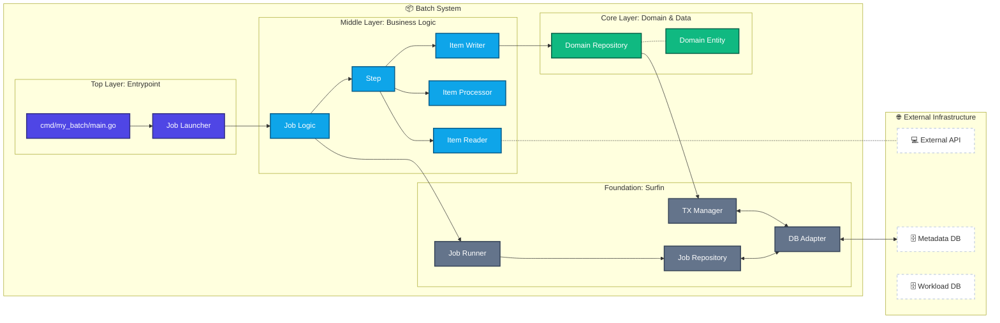

<p align="center">
  
</p>

# 🌊 Surfin - Batch framework

[](https://pkg.go.dev/github.com/tigerroll/surfin) [](https://github.com/tigerroll/surfin/blob/main/LICENSE) [](https://goreportcard.com/report/github.com/tigerroll/surfin)

English | [日本語](./README.ja.md)

A Cloud Native Batch framework for Go, inspired by JSR-352.

**Surfin** is designed with robustness, scalability, and operational ease as top priorities.
<br/> It provides the execution infrastructure required for production batch processing:
<br/> checkpointing, restartability, fault tolerance, transaction management, observability, and controlled parallel execution.

With declarative job definitions (JSL), Surfin separates business logic from batch execution concerns and provides a consistent model for executing, monitoring, and recovering batch jobs.

## Restartable Batch Processing Framework for Go

If a job fails partway through, you shouldn't have to start over from scratch.
<br/> Surfin brings the execution semantics and architectural patterns developed through JSR-352 and enterprise batch processing into Go.
<br/> Instead of rebuilding restartability, checkpointing, retry, skip, and failure handling for every application, Surfin provides them as reusable batch infrastructure.

### 😱 Have you ever faced these challenges?

**If any of these sound familiar, Surfin is for you.**

* A batch job failed midway, and nobody knew how far it had gotten.
* You reran it from the start. The next morning, the data was duplicated.
* Someone built a table to track restart flags. Whoever understood the schema has since left the company.
* The logic for "has this been processed" is slightly different in every job.
* You were told "just make it idempotent" — the implementation cost turned out to be far higher than expected.
* Every incident turns into a discussion about where it's safe to resume from.
* The person who owned the batch system moved on, and the design intent went with them.

These are not problems unique to one application.
<br/> They are problems of **batch execution semantics**.
<br/> Surfin makes those semantics explicit and reusable.

## 🎯 Use Cases
Surfin provides the operational primitives that production batch processing needs out of the box — API integration, ETL, data synchronization, report generation, data lake ingestion, and more.

* **SaaS data integration**: `External API → CSV Stream → Transform → Database → Parquet → Data Lake`
* **ETL / data platform**: `API → Transform → Iceberg → Analytics`
* **Enterprise system integration**: `ERP → Batch → Data Warehouse`
* **Report generation**: `Database → Aggregation → CSV / PDF`
* **IoT / factory data**: `Sensor Data → Batch Processing → Parquet → Data Lake`

Focus on **what to process**.
<br/>Surfin handles **how to process it safely**.

## 🐹 Motivation: Why Surfin?

### Beyond DIY: Building Robust Batch Systems in Go

The Go community thrives on a "DIY" (Do It Yourself) culture, and rightfully so.
<br/> However, we don't need to reinvent the wheel when it comes to batch execution.
<br/> Challenges such as restartability, checkpoints, transaction boundaries, retry, skip, and failure handling are not new problems. They have been refined over decades of enterprise batch processing, including mainframe and Java environments such as JSR-352.
<br/> Surfin brings these architectural patterns to Go.
<br/> The implementation remains Go-like and lightweight, while the execution semantics are made explicit and reusable.

**For a deeper dive into the philosophy, read:**

<br/> [Borrow the best, build the rest: Go Batch Processing](./docs/articles/batching-the-go-way-inheriting-enterprise-patterns.md)

### Separation of Concerns: Business logic shouldn't even know it's part of a batch process

Surfin's design philosophy is rooted in separation of concerns.

```go
// Business logic shouldn't even know it's part of a batch process
func (p *ReportProcessor) Process(ctx context.Context, item Report) (ReportRecord, error) {
    return transform(item), nil
}
```

The processor only describes **what to do with an item**.

Operational concerns such as:

* how far the job has progressed
* where to save a restart point
* what happens when processing fails
* how retry and skip are applied
* how transactions are managed
* how execution is observed
* how partitions are executed concurrently

are handled by the batch framework.
<br/> This allows application code to focus on business logic while Surfin manages the execution semantics around it.

## 🚀 Getting Started with Surfin

Installation is straightforward.

```bash
go get github.com/tigerroll/surfin
```

👉 Start with the **[Getting Started guide](./docs/guide/00_getting_started.md)**.

A simple job can be defined with minimal YAML.

```yaml
jobs:
  - name: daily-report
    steps:
      - name: import-report
        reader:
          type: csv-stream
        processor:
          bean: transformReport
        writer:
          type: parquet
```

Flow and business logic are separate.
<br/> Changing the job flow does not require changing the business logic.

### A more realistic JSL (Job Specification Language) example

Transitions between steps, item-level retry/skip policies, and chunk size can all be declared in YAML.

```yaml
id: myJob
name: Sample Job

flow:
  start-element: extractStep
  elements:
    extractStep:
      id: extractStep
      chunk:
        reader:
          ref: myItemReader
        processor:
          ref: myItemProcessor
        writer:
          ref: myItemWriter
        chunk-size: 100
        item-retry:
          max_attempts: 3
          initial_interval: 1s
        item-skip:
          skip_limit: 10
      transitions:
        - on: COMPLETED
          to: notifyStep
        - on: FAILED
          fail: true

    notifyStep:
      id: notifyStep
      tasklet:
        ref: notifyTasklet
      transitions:
        - on: COMPLETED
          end: true
```

The job structure (`Job → Step → Chunk`) and fault-tolerance policies (`retry / skip`) are expressed declaratively without putting them into business logic.

## 📍 Key Problems Solved

### You don't know how far it got

`JobRepository` and `ExecutionContext` persist execution state and restart information at the chunk level.

```text
Chunk #1 ✓
Chunk #2 ✓
Chunk #3 ✓
Chunk #4 ✗
```

On a subsequent execution, Surfin restores the last persisted restart position and applies the job's execution semantics.

### Double execution is a risk

Surfin prevents conflicting concurrent job starts through repository-level execution control.

### You don't want to track resume points manually

Persisted execution state allows Surfin to determine which execution units have already completed and what needs to be executed again.

### You don't want to write retry logic every time

Retry and skip behavior can be declared as policies.

```yaml
faultTolerance:
  retry:
    maxAttempts: 3
  skip:
    limit: 100
```

## ♻️ Restart and Checkpointing

Surfin persists restart information through `ExecutionContext` as part of chunk execution.
<br/> On rerun, the framework restores the last persisted restart position and resumes according to the job's execution semantics.
<br.> The application only needs to define how its Reader saves and restores its position.

```go
// Reader saves its current position to ExecutionContext
func (r *MyReader) Update(ctx context.Context, ec *model.ExecutionContext) error {
    ec.PutInt("read.offset", r.currentOffset)
    return nil
}

// Open restores the position on rerun
func (r *MyReader) Open(ctx context.Context, ec *model.ExecutionContext) error {
    if offset, ok := ec.GetInt("read.offset"); ok {
        r.currentOffset = offset
    }
    return nil
}
```

The framework manages job execution, checkpoint persistence, restart detection, and completed execution handling.
<br/> Restartability is therefore part of the batch execution model rather than application-specific bookkeeping.

## ⚙️ Execution Semantics

Surfin treats batch execution as a set of explicit execution semantics.

```text
Execution Semantics
├── Chunk Execution
│   ├── Read
│   ├── Process
│   ├── Write
│   ├── Retry
│   ├── Skip
│   └── Checkpoint
│
└── Partition Execution
    ├── Worker
    ├── Controller
    ├── Concurrency
    ├── Partial Failure
    ├── Cancellation
    └── Restart
```

The goal is not simply to provide APIs for batch processing.
<br/> The goal is to make the behavior of a batch job predictable when execution succeeds, fails, is restarted, or runs in parallel.

### Failure semantics

A production batch system needs more than a happy path.

For example:

```text
Read
  ↓
Process
  ↓
Write
  ↓
Transaction Commit
  ↓
Checkpoint Persistence
```

Failures can occur at each stage.
<br/> Surfin defines these execution boundaries explicitly so that retry, skip, checkpoint, restart, and failure handling can be treated as parts of one execution model.

### Partition execution

Partitions represent logical units of work.

```text
Partition
   │
   ├── Local Worker
   │      └── goroutine
   │
   └── Remote Worker
          └── future execution model
```

A `Partition` describes **what range or scope is processed**.
<br/> A `Worker` is the logical execution subject responsible for processing that Partition.
<br/> A `Controller` manages Partition assignment, Worker lifecycle, cancellation, and result aggregation.
<br/> For local execution, Workers are implemented using Go concurrency primitives.
<br/> `partition.concurrency` controls the maximum number of Partitions executing concurrently.

```yaml
partition:
  concurrency: 4
```

This allows resource usage to be bounded without introducing a separate execution abstraction for every execution mode.
<br/> Remote execution is intentionally outside the scope of the current local execution model and can be introduced without changing the conceptual Partition model.

## ⚖️ Comparison with Existing Solutions

You can build all of this yourself.
<br/> Many teams do.

But once restartability, fault tolerance, transaction boundaries, and controlled concurrency become requirements, the cost of maintaining a custom batch execution model grows quickly.

| Feature                    | Custom (Go) | JSR-352 (Java)      | Surfin (Go)  |
| -------------------------- | ----------- | ------------------- | ------------ |
| Chunk-based processing     | custom      | ✅ built-in          | ✅ built-in   |
| Restartability             | custom      | ✅ built-in          | ✅ built-in   |
| Fault tolerance            | custom      | ✅ built-in          | ✅ built-in   |
| Declarative job definition | custom      | ✅ XML / Java Config | ✅ YAML (JSL) |
| Transaction management     | custom      | ✅ built-in          | ✅ built-in   |
| Execution metadata         | custom      | ✅ built-in          | ✅ built-in   |
| Observability integration  | custom      | ecosystem-dependent | ✅ built-in   |
| Parallel execution         | custom      | ✅ built-in          | ✅ built-in   |
| Job control                | custom      | ✅ built-in          | ✅ built-in   |

The goal is not to replace the ideas behind JSR-352.
<br/> Surfin brings those ideas into a Go-native programming model.

## 🏗️ Architecture

Surfin separates business processing from batch execution and execution-state persistence.


```mermaid
graph LR
    %% Style definitions
    classDef entry fill:#4f46e5,color:#fff,stroke:#312e81,stroke-width:2px
    classDef logic fill:#0ea5e9,color:#fff,stroke:#075985,stroke-width:2px
    classDef core fill:#64748b,color:#fff,stroke:#334155,stroke-width:2px
    classDef domain fill:#10b981,color:#fff,stroke:#065f46,stroke-width:2px
    classDef cloud fill:#fff,stroke:#cbd5e1,stroke-width:2px,stroke-dasharray: 5 5

    %% External boundaries
    subgraph External ["&nbsp; 🌐 External Infrastructure &nbsp;"]
        direction LR
        HTTP["💻&nbsp;External API"]:::cloud
        MetadataDB["🗄️&nbsp;Metadata DB"]:::cloud
        WorkloadDB["🗄️&nbsp;Workload DB"]:::cloud
    end

    %% Application core
    subgraph Application ["&nbsp; 📦 Batch System &nbsp;"]
        direction LR

        subgraph Layer_Entry ["Top Layer: Entrypoint"]
            Main["cmd/my_batch/main.go"]:::entry
            Launcher["Job Launcher"]:::entry
        end

        subgraph Layer_Logic ["Middle Layer: Business Logic"]
            direction LR
            Job["Job Logic"]:::logic
            Step["Step"]:::logic
            Reader["Item Reader"]:::logic
            Processor["Item Processor"]:::logic
            Writer["Item Writer"]:::logic
        end

        subgraph Layer_Core ["Foundation: Surfin"]
            direction LR
            Runner["Job Runner"]:::core
            Repository["Job Repository"]:::core
            TX["TX Manager"]:::core
            DB_Adapter["DB Adapter"]:::core
        end

        subgraph Layer_Domain ["Core Layer: Domain & Data"]
            direction LR
            Repo["Domain Repository"]:::domain
            Entity["Domain Entity"]:::domain
        end
    end

    %% Connection and execution flow
    Main --> Launcher
    Launcher --> Job
    Job --> Step
    Step --> Reader
    Step --> Processor
    Step --> Writer

    %% Framework and metadata persistence
    Job --> Runner
    Runner --> Repository
    Repository <--> DB_Adapter
    DB_Adapter <--> MetadataDB

    %% Business data persistence
    Writer --> Repo
    Repo --> TX
    TX <--> DB_Adapter
    Repo -.- Entity

    %% External input
    Reader -.- HTTP

    %% Layout control
    Layer_Entry ~~~ Layer_Logic
    Layer_Logic ~~~ Layer_Core
    Layer_Core ~~~ Layer_Domain
```

### Surfin's Design Principles

1. **Chunking**
   * Process data in chunks to establish explicit transaction and checkpoint boundaries.
2. **Execution State**
   * Persist execution metadata so the system knows what has already happened and where restart can begin.
3. **Explicit Restart Points**
   * Make restart positions part of the execution model rather than application-specific bookkeeping.
4. **Controlled Parallelism**
   * Use Partition-based execution and configurable concurrency to scale processing while keeping resource usage explicit.
5. **Separation of Concerns**
   * Keep business logic independent from batch execution concerns such as retry, checkpointing, restart, and execution control.

<p align="center">
  
</p>

## 🛠️ Key Features

* **📦 Chunk-based processing**: Process items in chunks with explicit transaction and checkpoint boundaries.
* **♻️ Restartability**: Persist restart information and resume according to the execution state.
* **🛡️ Fault tolerance**: Retry, skip, and configurable backoff declared as policy.
* **📋 Declarative job definition**: Define job flow, components, chunk size, retry, and skip policies using YAML (JSL).
* **🔄 Transaction management**: Integrate transaction boundaries with batch execution, including `REQUIRED` and `REQUIRES_NEW` propagation.
* **✨ Observability**: OpenTelemetry and Prometheus integration for batch execution and operational visibility.
* **📈 Partition execution**: Execute logical Partitions concurrently with configurable `partition.concurrency`.
* **🔒 Job control**: Repository-level execution control and job lifecycle management.
* **💾 Execution metadata**: Persist Job / Step execution state and restart information.
* **🧩 Extensible adapters**: Integrate application-specific databases, storage systems, APIs, and other infrastructure through adapters and interfaces.

## 📚 Documentation & Usage

* [Getting Started](./docs/guide/00_getting_started.md)
* [Introduction & Core Concepts](./docs/guide/01_introduction.md)
* [Setup & JSL Definition](./docs/guide/02_setup_and_jsl.md)
* [Step Types & Components](./docs/guide/03_chunk_components.md)
* [Fault Tolerance & Transaction Management](./docs/guide/04_fault_tolerance.md)
* [Roadmap](./docs/roadmap.md)

### Architecture & Design

* [Vision & Design Principles](./docs/architecture/01_vision_and_principles.md)
* [Architecture Overview](./docs/architecture/02_architecture.md)
* [Partition Execution Design](./docs/design/partition_execution.md)

## 🆘 Support

Questions, bug reports, and feature requests go through GitHub Issues.

* **GitHub Issues**: [Report bugs / request features](https://github.com/tigerroll/surfin/issues)

## 📄 License

MIT License.
