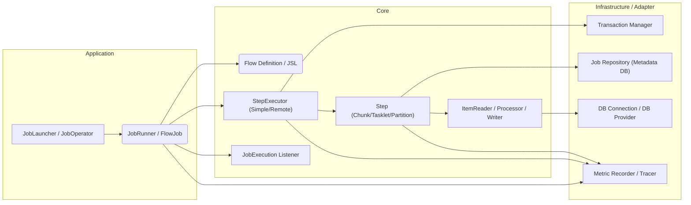
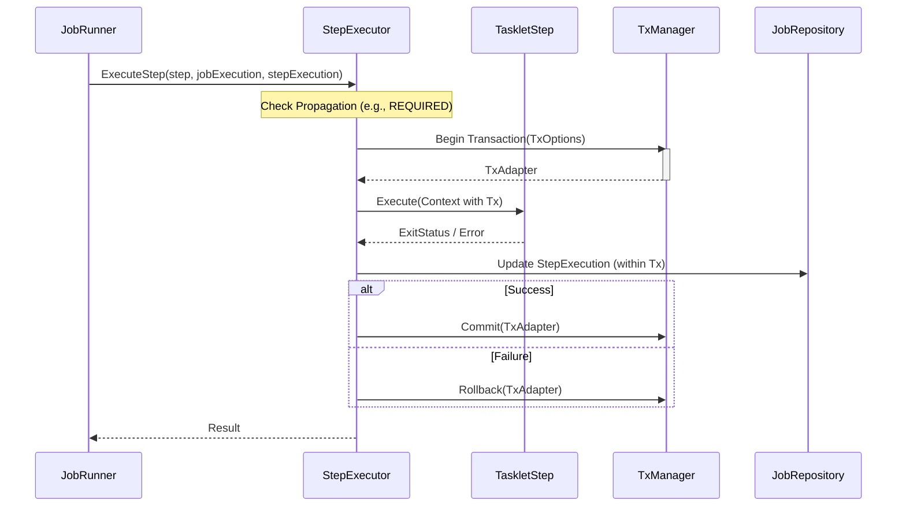

# 2. アーキテクチャの全体像と層構造

Surfin Batch Frameworkは、明確に定義された層構造を持ち、Go Fxによる依存性注入（DI）によってコンポーネント間の結合を管理します。

## 2.1. 高レベルアーキテクチャ概要

フレームワークは、Application、Core、Infrastructure/Adapter の3つの主要な層で構成されています。



## 2.2. レイヤー定義

| レイヤー | パッケージ | 責務 |
| :--- | :--- | :--- |
| **Adapter** | `pkg/batch/adapter/` | 外部システム（DB、メッセージング等）との接続を抽象化する具体的な実装。 |
| **Component** | `pkg/batch/component/` | 再利用可能なバッチコンポーネント（`ItemReader`, `Tasklet` 等）の実装。 |
| **Core** | `pkg/batch/core/` | フレームワークの核となるインターフェース、モデル、実行ロジック。 |
| **Engine** | `pkg/batch/engine/` | バッチ処理の実行エンジン（`StepExecutor`）や具体的なステップ実装。 |
| **Infrastructure** | `pkg/batch/infrastructure/` | 外部システム接続（DB、Tx、リポジトリ）の具体的な実装。 |
| **Listener** | `pkg/batch/listener/` | ライフサイクルイベントを処理するリスナーの実装。 |
| **Support** | `pkg/batch/support/` | 汎用ユーティリティ（ロギング、例外処理等）。 |

## 2.3. プロジェクト構造

```
├── pkg/batch/              # Surfin Batch Framework Core
│   ├── adapter/            # 外部システムとの接続を抽象化する具体的な実装
│   ├── component/          # 再利用可能なバッチコンポーネント
│   ├── core/               # フレームワークの核となるインターフェース、モデル
│   ├── engine/             # バッチ処理の実行エンジン
│   ├── infrastructure/     # Core インターフェースの具体的な実装
│   ├── listener/           # ライフサイクルイベントリスナー
│   └── support/            # 汎用ユーティリティ
└── example/weather/        # Example Application
```

## 2.4. 実行フロー

JobLauncherがJobExecutionを作成した後、JobRunnerがフロー定義に従って要素を順次実行します。

### 2.4.1. 起動とJobFactory

 1 DIコンテナ (Fx): アプリケーション起動時に、すべてのコンポーネント（DBProvider, TxManager, ComponentBuilderなど）が初期化され、依存関係が解決されます。
 2 JobFactory: すべてのコンポーネントビルダーを保持し、JSL定義に基づいて実行可能な core.Job インスタンス（runner.FlowJob）を動的に構築します。

### 2.4.2. JobLauncherとJobRunner

 1 JobLauncher: 実行要求を受け取り、JobInstance の検索/作成、JobExecution の初期化、および再起動ロジック（JobParametersIncrementer の適用を含む）を実行します。
 2 JobRunner (runner.SimpleJobRunner): FlowJob の実行を担当します。JSLで定義されたフロー（Step, Decision, Split）を辿り、JobExecution の状態を管理します。

### 2.4.3. StepExecutorの役割

JobRunnerからStepの実行を委譲されたStepExecutorは、以下の責務を持ちます。

 - SimpleStepExecutor: ローカルでStepを実行します。Stepの伝播属性（REQUIRED, REQUIRES_NEW, NESTED）に基づいてトランザクション境界を確立します。
 - RemoteStepExecutor: RemoteJobSubmitter を使用して、Stepの実行を外部オーケストレーター（例: Surfin Bird）に委譲し、メタデータリポジトリをポーリングして完了を待ちます。

## 2.5. データ永続化 (JobRepository)

バッチメタデータ（Job/Step Execution, Checkpoint Data）の永続化は、core/domain/repository.JobRepository インターフェースを通じて行われます。

### 2.5.1. Tasklet Step の実行フローとトランザクション

Tasklet Step の実行時、StepExecutor は Step の伝播属性に基づいてトランザクション境界を確立します。



### 2.5.2. JobRepository とトランザクション

 - トランザクションの検出: GORMJobRepository は、操作を実行する際、現在の context.Context に tx.Tx が存在するかどうかをチェックします。
    - Txあり: 既存のトランザクションに参加し、tx.TxExecutor を使用して操作を実行します。
    - Txなし: adapter.DBConnection を使用して非トランザクション操作を実行します（主に読み取り操作や、StepExecutorがトランザクションを開始しない場合の書き込み）。
