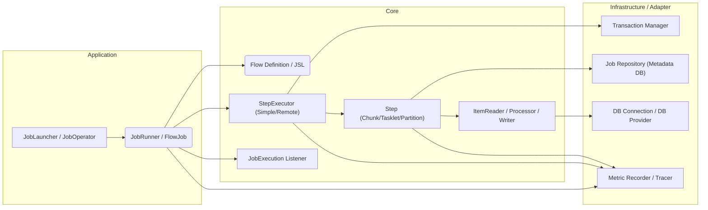

# 2. アーキテクチャの全体像と層構造

Surfin Batch Frameworkは、明確に定義された層構造を持ち、Go Fxによる依存性注入（DI）によってコンポーネント間の結合を管理します。

## 2.1. 高レベルアーキテクチャ概要



## 2.2. レイヤー定義

| レイヤー | パッケージ | 責務 |
| :--- | :--- | :--- |
| **Adapter** | `pkg/batch/adapter/` | 外部システム（DB、メッセージング等）との接続を抽象化する具体的な実装。 |
| **Component** | `pkg/batch/component/` | 再利用可能なバッチコンポーネント（`ItemReader`, `Tasklet` 等）の実装。 |
| **Core** | `pkg/batch/core/` | フレームワークの核となるインターフェース、モデル、実行ロジック。 |
| **Engine** | `pkg/batch/engine/` | バッチ処理の実行エンジン（`StepExecutor`）や具体的なステップ実装。 |
| **Infrastructure** | `pkg/batch/infrastructure/` | 外部システム接続（DB、Tx、リポジトリ）の具体的な実装。 |
| **Listener** | `pkg/batch/listener/` | ライフサイクルイベントを処理するリスナーの実装。 |
| **Support** | `pkg/batch/support/` | 汎用ユーティリティ（ロギング、例外処理等）。 |

## 2.3. プロジェクト構造

```
├── pkg/batch/              # Surfin Batch Framework Core
│   ├── adapter/            # 外部システムとの接続を抽象化する具体的な実装
│   ├── component/          # 再利用可能なバッチコンポーネント
│   ├── core/               # フレームワークの核となるインターフェース、モデル
│   ├── engine/             # バッチ処理の実行エンジン
│   ├── infrastructure/     # Core インターフェースの具体的な実装
│   ├── listener/           # ライフサイクルイベントリスナー
│   └── support/            # 汎用ユーティリティ
└── example/weather/        # Example Application
```
