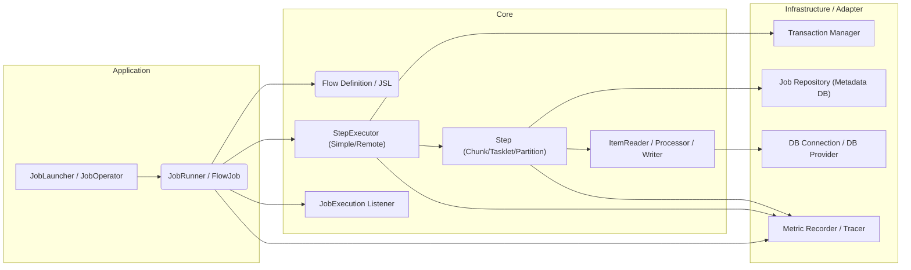
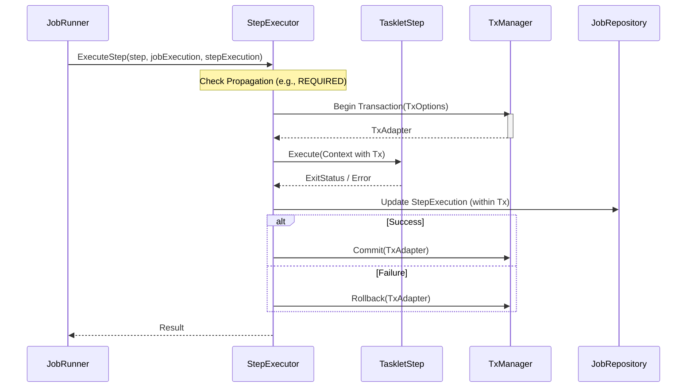

# 2. フレームワークの層構造と実行フロー

Surfin Batch Frameworkは、明確に定義された層構造を持ち、Go Fxによる依存性注入（DI）によってコンポーネント間の結合を管理します。

## 2.0. 高レベルアーキテクチャ概要

フレームワークは、Application、Core、Infrastructure/Adapter の3つの主要な層で構成されています。

## 2.1. 主要な層構造

### 2.1.1. Application 層

ユーザーからのリクエストを受け付け、ジョブのライフサイクルを管理します。

 - JobLauncher: ジョブの起動、JobInstanceの識別、JobExecutionの初期化を行います。
 - JobOperator: 実行中のジョブの操作（停止、再開、放棄）を管理します。

### 2.1.2. Core 層

バッチ処理の実行モデル（Job, Step, Flow）とビジネスロジックの抽象化を担います。

 - JobRunner / FlowJob: JSLで定義されたフローに従って、StepExecutorを呼び出し、実行順序を制御します。
 - StepExecutor: Stepの実行を担い、トランザクション境界の確立、再起動ロジックの適用、リモート実行の委譲を処理します。
 - Step (Chunk/Tasklet/Partition): 実際の処理ロジック（ItemReader/Processor/WriterまたはTasklet）をカプセル化します。
 - ExecutionContext: ジョブおよびステップ間で状態を共有するためのコンテキストです。

### 2.1.3. Infrastructure / Adapter 層

外部システムとの接続や、フレームワークの永続化・オブザーバビリティを担います。

 - JobRepository: JobExecution, StepExecution, CheckpointData などのメタデータを永続化します。
 - TransactionManager: トランザクションの開始、コミット、ロールバックを抽象化します。
 - DBConnection / DBProvider: `pkg/batch/adapter` パッケージ内の具体的な実装（例: GORM）を通じて、`pkg/batch/core/adapter` で定義されたインターフェースを提供し、データベース接続を管理します。
 - MetricRecorder / Tracer: PrometheusやOpenTelemetryなどの外部オブザーバビリティシステムへの連携を抽象化します。

## 2.2. 実行フロー

JobLauncherがJobExecutionを作成した後、JobRunnerがフロー定義に従って要素を順次実行します。

### 2.2.1. 起動とJobFactory

 1 DIコンテナ (Fx): アプリケーション起動時に、すべてのコンポーネント（DBProvider, TxManager, ComponentBuilderなど）が初期化され、依存関係が解決されます。
 2 JobFactory: すべてのコンポーネントビルダーを保持し、JSL定義に基づいて実行可能な core.Job インスタンス（runner.FlowJob）を動的に構築します。

### 2.2.2. JobLauncherとJobRunner

 1 JobLauncher: 実行要求を受け取り、JobInstance の検索/作成、JobExecution の初期化、および再起動ロジック（JobParametersIncrementer の適用を含む）を実行します。
 2 JobRunner (runner.SimpleJobRunner): FlowJob の実行を担当します。JSLで定義されたフロー（Step, Decision, Split）を辿り、JobExecution の状態を管理します。

### 2.2.3. StepExecutorの役割

JobRunnerからStepの実行を委譲されたStepExecutorは、以下の責務を持ちます。

 - SimpleStepExecutor: ローカルでStepを実行します。Stepの伝播属性（REQUIRED, REQUIRES_NEW, NESTED）に基づいてトランザクション境界を確立します。
 - RemoteStepExecutor: RemoteJobSubmitter を使用して、Stepの実行を外部オーケストレーター（例: Surfin Bird）に委譲し、メタデータリポジトリをポーリングして完了を待ちます。

## 2.3. データ永続化 (JobRepository)

バッチメタデータ（Job/Step Execution, Checkpoint Data）の永続化は、core/domain/repository.JobRepository インターフェースを通じて行われます。

### 2.3.1. Tasklet Step の実行フローとトランザクション

Tasklet Step の実行時、StepExecutor は Step の伝播属性に基づいてトランザクション境界を確立します。

### 2.3.2. JobRepository とトランザクション

 - トランザクションの検出: GORMJobRepository は、操作を実行する際、現在の context.Context に tx.Tx が存在するかどうかをチェックします。
    - Txあり: 既存のトランザクションに参加し、tx.TxExecutor を使用して操作を実行します。
    - Txなし: adapter.DBConnection を使用して非トランザクション操作を実行します（主に読み取り操作や、StepExecutorがトランザクションを開始しない場合の書き込み）。
