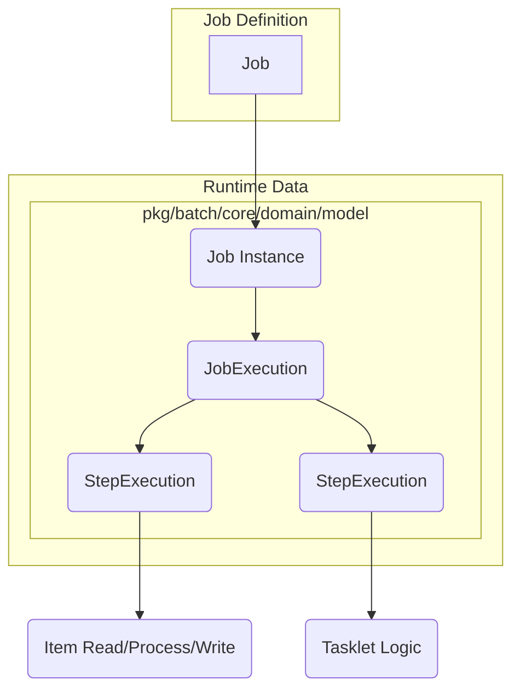

# ユーザーガイド: 1. 導入と主要概念

Surfin Batch Frameworkは、Go言語で堅牢かつスケーラブルなバッチ処理アプリケーションを構築するためのフレームワークです。Spring BatchやJava EE Batch (JSR-352) の概念に基づき、トランザクション管理、障害耐性（リトライ/スキップ）、並列処理、メタデータ管理などの機能を提供します。

## 1.1. 主要な概念

Surfin Batchは、バッチ処理を構成する様々な要素を明確に定義し、それぞれが連携して動作するよう設計されています。

*   **Job**: バッチ処理全体の定義。JSL (Job Specification Language) で定義されます。
*   **Job Instance**: 特定のジョブ名とパラメータの組み合わせによる論理的な実行単位。Goの `model.JobInstance` に対応します。
*   **Job Execution**: Job Instanceの物理的な実行試行。再起動ごとに新しいExecutionが作成されます。Goの `model.JobExecution` に対応します。
*   **Step**: Job内の独立した処理単位。Tasklet処理かChunk処理のいずれかを行います。Goの `port.Step` インターフェースに対応します。
*   **Step Execution**: 特定のStepの実行試行。Goの `model.StepExecution` に対応します。
*   **JobParameters**: ジョブ実行時に渡されるパラメータ。JobInstance の一意性を決定する。Goの `model.JobParameters` に対応します。
*   **ExecutionContext**: ジョブおよびステップ間で状態を永続化・共有するためのキー/バリューマップです。Goの `model.ExecutionContext` に対応します。

## 1.2. Stepのタイプ

Surfin BatchのStepには主に2つのタイプがあります。

### Chunk Processing (チャンク処理)

*   データを「読み込み (Read) → 処理 (Process) → 書き込み (Write)」というサイクルで、設定されたチャンクサイズ（例: 100件）ごとに繰り返します。
*   チャンクサイズに達するか、読み込みが終了するたびに、トランザクションがコミットされます。
*   大量のデータを効率的に処理するのに適しています。

### Tasklet (タスクレット)

*   単一の操作（例: ファイル移動、DBマイグレーション、API呼び出し）を実行するシンプルなStepです。
*   Tasklet全体が一つのトランザクション内で実行されます。
*   データ処理以外の、インフラ操作やユーティリティ的な処理に適しています。
