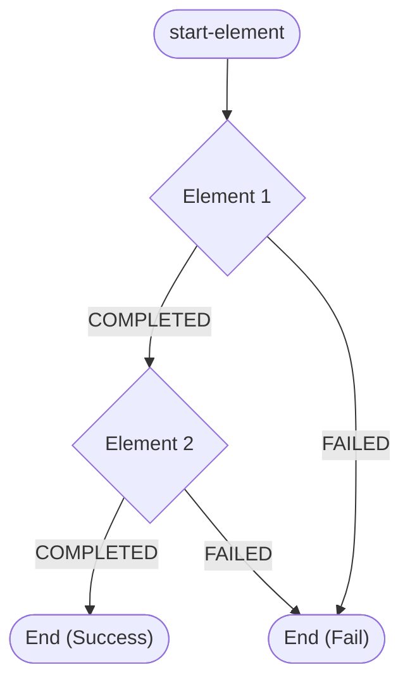

# ユーザーガイド: 2. プロジェクトのセットアップとJSL定義

## 2.1. プロジェクトのセットアップ

### アプリケーション構造

典型的なバッチアプリケーションは、以下の要素で構成されます。

1.  `cmd/`: アプリケーションのエントリポイント (`main.go`)。
2.  `resources/`: JSLファイル (`job.yaml`) や設定ファイル (`application.yaml`)、DBマイグレーションファイル。
3.  `internal/`: カスタムコンポーネント（Reader, Processor, Writer, Tasklet）の実装。

## 2.2. Job Specification Language (JSL) の定義

JSLは、YAML形式でジョブの定義 (`JobDefinition`) を記述します。これは、ジョブのID、説明、ジョブレベルのリスナー、そしてジョブの実行フローを定義します。フローは複数の`elements`（ステップ、デシジョン、スプリットなど）とその`transition`（遷移ルール）で構成されます。`ref` 属性は、Goアプリケーションで登録されたコンポーネント名と一致させる必要があります。

### JSLの基本構造

```yaml
id: mySimpleJob # ジョブの一意なID
name: My Simple Batch Job # ジョブの表示名
description: This is a basic example job. # ジョブの説明

flow:
  start-element: firstStep # フローの開始要素を指定
  elements:
    firstStep:
      id: firstStep # ステップの一意なID
      tasklet:
        ref: myTasklet # Goコードで実装されたTaskletを参照
        properties:
          message: "Hello from Tasklet!" # Taskletに渡すプロパティ
      transitions: # この要素からの遷移ルール
        - on: COMPLETED # firstStepが完了したら
          end: true     # ジョブを終了
        - on: FAILED    # firstStepが失敗したら
          fail: true    # ジョブを失敗として終了
```

#### フローの概念図



*   **`id`**: ジョブ、ステップ、デシジョンなどの各要素に割り当てる一意な識別子です。
*   **`start-element`**: ジョブフローの開始となる要素の `id` を指定します。
*   **`elements`**: ジョブを構成する全てのステップ、デシジョン、スプリットなどの要素を定義します。
*   **`transitions`**: 各要素の実行結果（`on`）に基づいて、次にどの要素に遷移するか（`to`）、あるいはジョブを終了させるか（`end`, `fail`, `stop`）を定義します。

### 2.3. コンポーネント参照 (`ref` と `properties`)

JSL内で `ref` を使用して、Goコードで実装されたコンポーネント（Reader, Writer, Tasklet, Decisionなど）を参照します。`properties` マップを通じて、実行時にコンポーネントに設定値を注入できます。

*   **`ref`**: Goコードで実装されたコンポーネントの名前を指定します。この名前は、Goアプリケーション側でコンポーネントを登録する際に使用する名前と一致させる必要があります。
*   **`properties`**: コンポーネントに渡す設定値（キーと値のペア）を定義します。これらの値は、コンポーネントのGoコード内で読み取られ、動作をカスタマイズするために使用されます。

**例: `fetchWeatherDataStep` の `reader` 設定 (example/weather/cmd/weather/resources/job.yaml より抜粋)**

```yaml
    fetchWeatherDataStep:
      id: fetchWeatherDataStep
      reader:
        ref: weatherItemReader # Goコードで登録されたビルダー名
        properties:
          apiEndpoint: "https://api.open-meteo.com/v1" # Reader固有のプロパティ
          apiKey: "your_api_key"
      # ...
```

`properties` に定義された値は、コンポーネントのコンストラクタ関数に `map[string]string` として渡され、`configbinder.BindProperties` ユーティリティ関数などを使用して構造体にバインドできます。

```go
// Goコードでのプロパティバインド例
type MyReaderConfig struct {
	APIEndpoint string `yaml:"apiEndpoint"`
	APIKey      string `yaml:"apiKey"`
}

func NewMyReader(properties map[string]string) (*MyReader, error) {
	cfg := &MyReaderConfig{}
	if err := configbinder.BindProperties(properties, cfg); err != nil {
		return nil, fmt.Errorf("failed to bind properties: %w", err)
	}
	// ... cfg を使用してReaderを初期化 ...
	return &MyReader{config: cfg}, nil
}
```


