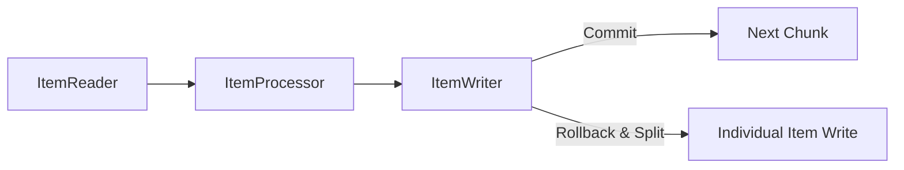

# ユーザーガイド: 3. カスタムコンポーネントの実装

Surfin Batchでは、バッチ処理の具体的なロジックを、`pkg/batch/core/application/port` に定義されているインターフェースを実装したGoの構造体として定義します。

## 3.1. ItemReader, ItemProcessor, ItemWriter (チャンク処理)

チャンク処理のデータフローは以下のようになります。



*   **`port.ItemReader[O any]`**: データソースからアイテムを1つずつ読み込みます。
    *   主要メソッド: `Read(ctx context.Context) (O, error)`
    *   読み込みが完了したら `io.EOF` を返します。
    *   `Open`, `Close`, `SetExecutionContext`, `GetExecutionContext` メソッドも実装します。
*   **`port.ItemProcessor[I, O any]`**: 読み込んだアイテムを変換したり、フィルタリングしたりします。
    *   主要メソッド: `Process(ctx context.Context, itemIn I) (itemOut O, error)`
    *   アイテムをフィルタリングして後続処理に渡さない場合は `nil, nil` を返します。
    *   `SetExecutionContext`, `GetExecutionContext` メソッドも実装します。
*   **`port.ItemWriter[O any]`**: 処理されたアイテムのリスト（チャンク）をまとめて永続化します。
    *   主要メソッド: `Write(ctx context.Context, tx tx.Tx, items []O) error`
    *   `tx.Tx` はトランザクションを表し、このオブジェクトを使ってデータベース操作を行います。
    *   `Open`, `Close`, `SetExecutionContext`, `GetExecutionContext` メソッドも実装します。

#### シンプルな擬似コード例

```go
// ItemReaderの例
type MyReader struct {
    // ... 内部状態 ...
}

func (r *MyReader) Read(ctx context.Context) (any, error) {
    // データソースから1つ読み込むロジック
    // 例: API呼び出し、ファイル読み込み
    return "Hello", nil // または io.EOF (読み込み終了)
}

// ItemProcessorの例
type MyProcessor struct {
    // ... 内部状態 ...
}

func (p *MyProcessor) Process(ctx context.Context, item any) (any, error) {
    // アイテムを加工するロジック
    // 例: 文字列を大文字にする、データ型を変換する
    return item.(string) + " World!", nil
}

// ItemWriterの例
type MyWriter struct {
    // ... 内部状態 ...
}

func (w *MyWriter) Write(ctx context.Context, tx tx.Tx, items []any) error {
    // データベースに書き込むロジック (txを使って)
    for _, item := range items {
        fmt.Printf("Writing: %v\n", item) // 例: コンソール出力
    }
    return nil
}

// 各コンポーネントは、Open, Close, SetExecutionContext, GetExecutionContext メソッドも実装する必要があります。
// これらのメソッドは、リソースの初期化/解放や、ジョブの再起動のための状態保存/復元に利用されます。
```

より具体的な実装例は、`example/weather/internal/application/step` ディレクトリ内の `reader.go`, `processor.go`, `writer.go` を参照してください。

## 3.2. Tasklet の実装

Taskletは、単一の処理を実行するシンプルなインターフェースです。

*   **`port.Tasklet`**: 任意のビジネスロジックを実行します。
    *   主要メソッド: `Execute(ctx context.Context, stepExecution *model.StepExecution) (model.ExitStatus, error)`
    *   処理結果として `model.ExitStatusCompleted` や `model.ExitStatusFailed` などの `model.ExitStatus` を返します。
    *   `SetExecutionContext`, `GetExecutionContext` メソッドも実装します。

#### シンプルな擬似コード例

```go
// Taskletの例
type MyTasklet struct {
    message string // JSLから注入されるプロパティ
}

func (t *MyTasklet) Execute(ctx context.Context, stepExecution *model.StepExecution) (model.ExitStatus, error) {
    fmt.Printf("Tasklet executing: %s (Step: %s)\n", t.message, stepExecution.StepName)
    // 任意の処理... (例: ファイル操作、API呼び出し、DBマイグレーション)
    return model.ExitStatusCompleted, nil // 処理が成功したらCOMPLETEDを返す
}
```

より具体的な実装例は、`pkg/batch/component/tasklet/migration/tasklet.go` を参照してください。

## 3.3. Decision の実装

`port.Decision` インターフェースは、ジョブフローの条件分岐を定義するために使用されます。

*   **`port.Decision`**: `ExecutionContext` や `JobParameters` に基づいて次の遷移を決定します。
    *   主要メソッド: `Decide(ctx context.Context, jobExecution *model.JobExecution, jobParameters model.JobParameters) (model.ExitStatus, error)`
    *   決定結果として `model.ExitStatus` を返します。この `ExitStatus` に基づいてJSLで定義された遷移ルールが適用されます。
    *   `DecisionName`, `ID`, `SetProperties` メソッドも実装します。

#### シンプルな擬似コード例

```go
// Decisionの例
type MyDecision struct {
    conditionKey string // JSLから注入されるプロパティ
    expectedValue string
}

func (d *MyDecision) Decide(ctx context.Context, jobExecution *model.JobExecution, jobParameters model.JobParameters) (model.ExitStatus, error) {
    // JobExecutionContextから値を取得し、条件を評価
    if val, ok := jobExecution.ExecutionContext.Get(d.conditionKey); ok && fmt.Sprintf("%v", val) == d.expectedValue {
        return model.ExitStatusCompleted, nil // 条件が満たされたらCOMPLETEDを返す
    }
    return model.ExitStatusFailed, nil // 条件が満たされなければFAILEDを返す
}
```

より具体的な実装例は、`pkg/batch/component/flow/conditional_decision.go` を参照してください。

## 3.4. ExecutionContext (状態の永続化)

`ExecutionContext` は、ジョブやステップ間で状態を共有・永続化するためのキー/バリューマップです。

*   `ItemReader`, `ItemWriter`, `Tasklet`, `Decision` といったコンポーネントは、`Open()`, `Close()`, `SetExecutionContext()`, `GetExecutionContext()` メソッドを通じて、このコンテキストから状態を復元したり、保存したりできます。
*   これにより、ジョブが途中で失敗した場合でも、中断した時点から正確に再開できるようになります。

#### `ExecutionContext` の利用例

```go
// GetExecutionContext メソッド内で状態を保存
func (r *MyReader) GetExecutionContext(ctx context.Context) (model.ExecutionContext, error) {
    ec := model.NewExecutionContext()
    ec.Put("lastReadIndex", r.currentIndex) // 最後に読み込んだインデックスを保存
    return ec, nil
}

// SetExecutionContext メソッド内で状態を復元
func (r *MyReader) SetExecutionContext(ctx context.Context, ec model.ExecutionContext) error {
    if idx, ok := ec.GetInt("lastReadIndex"); ok {
        r.currentIndex = idx // 保存されたインデックスから再開
    }
    return nil
}
```

JSLの `execution-context-promotion` 設定を使用すると、ステップの `ExecutionContext` の特定のキーをジョブの `ExecutionContext` に昇格させることができます。これにより、異なるステップ間で状態を共有したり、ジョブ全体の再起動時に利用したりすることが可能になります。

```yaml
    fetchWeatherDataStep:
      # ...
      execution-context-promotion: # StepExecutionContext の値を JobExecutionContext に昇格
        keys:
          - "reader_context" # WeatherReader が保存したコンテキスト全体を昇格
          - "decision.condition" # Decision ステップでチェックされる条件キー
```
