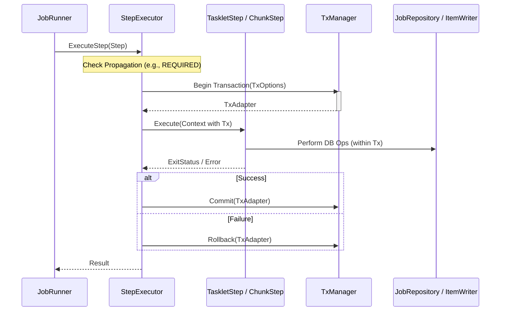

# ユーザーガイド: 4. 障害耐性 (Fault Tolerance) とトランザクション管理

Surfin Batch Frameworkは、アイテム処理中に発生する一時的なエラーやスキップ可能なエラーに対して、自動的なリトライおよびスキップ機能を提供し、堅牢なバッチ処理を実現します。

## 4.1. エラーの分類と `BatchError` の利用

フレームワークは、エラーを以下の3種類に分類します。

1.  **Retryable Error (リトライ可能)**: 一時的なネットワーク障害やデッドロックなど、再試行によって成功する可能性があるエラー。
2.  **Skippable Error (スキップ可能)**: データ品質の問題や外部システムの制約違反など、特定のアイテムを無視して処理を続行できるエラー。
3.  **Fatal Error (致命的)**: システム設定の誤りや永続的なデータ破損など、Jobの続行が不可能なエラー。

カスタムコンポーネント（Reader, Processor, Writer）内でエラーを発生させる際は、フレームワークの `exception.BatchError` を使用して、そのエラーの性質を明示的に定義することを強く推奨します。

```go
import "github.com/tigerroll/surfin/pkg/batch/support/util/exception"
import "errors"

// リトライ可能なエラーの作成
transientErr := errors.New("database connection timeout")
retryableBatchErr := exception.NewBatchError("reader", "Transient DB error", transientErr, false, true) // isSkippable: false, isRetryable: true

// スキップ可能なエラーの作成
constraintErr := errors.New("unique constraint failed")
skippableBatchErr := exception.NewBatchError("writer", "Data constraint violation", constraintErr, true, false) // isSkippable: true, isRetryable: false
```

## 4.2. JSLでのポリシー設定

JSLのChunk Step定義内で、リトライポリシーとスキップポリシーを設定します。

### Item Retry Policy

`item-retry` を使用して、Read/Process/Writeフェーズでのアイテムレベルのリトライを設定します。

```yaml
        - id: myChunkStep
          chunk:
            # ...
            item-retry:
              max_attempts: 3 # 最大3回リトライ
              initial_interval: 1s # 初回リトライまでの待機時間
              retryable_exceptions:
                - BatchError # BatchError型をリトライ対象とする
                - io.EOF # 登録された特定のエラー型 (例: io.EOF)
                - net.OpError # ネットワーク操作エラー
```

### Item Skip Policy

`item-skip` を使用して、Read/Process/Writeフェーズでのアイテムレベルのスキップを設定します。

```yaml
            item-skip:
              skip_limit: 10 # 許容されるスキップの総数
              skippable_exceptions:
                - BatchError
                - json.UnmarshalTypeError # 例: JSONの型変換エラー
```

### チャンク分割 (Chunk Splitting)

`ItemWriter`でスキップ可能なエラーが発生した場合、フレームワークは自動的に現在のチャンクのトランザクションをロールバックし、アイテムを一つずつ再書き込み（チャンク分割）します。

*   チャンク全体をロールバックします。
*   元のチャンク内のアイテムを**一つずつ**取り出し、個別のトランザクションで再書き込みを試みます。
    このロジックは `ChunkStep` 内部で自動的に処理され、エラーの原因となったアイテムを特定し、それ以外のアイテムの永続化を保証します。
*   再書き込みで失敗したアイテムはスキップとして記録され、成功したアイテムはコミットされます。

## 4.3. トランザクション管理

Surfin Batchは、Spring Batchのトランザクション伝播属性に類似した概念をサポートし、`SimpleStepExecutor` がトランザクション境界を確立します。



*   **トランザクション伝播属性**: JSLでステップごとにトランザクションの振る舞いを設定できます（例: `REQUIRED`, `REQUIRES_NEW`, `NESTED`）。これにより、ビジネスロジックとトランザクション管理が分離されます。
*   **コンテキスト伝播**: トランザクションは `context.Context` の値として `tx.Tx` インターフェースを格納することで、コンポーネント間で透過的に伝播されます。`ItemWriter` や `JobRepository` は、このコンテキストから `tx.Tx` を取得し、トランザクション内でデータベース操作を実行します。
