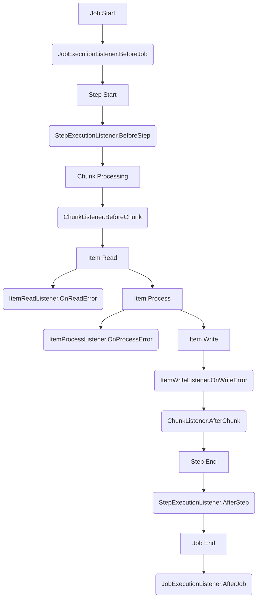

# ユーザーガイド: 5. リスナーの実装と登録

Surfin Batchは、ジョブ実行の主要なライフサイクルイベントに介入するためのリスナーインターフェースを提供します。

## 5.1. リスナータイプ

Surfin Batchは、ジョブやステップの様々なライフサイクルイベントにカスタムロジックを挿入するための「リスナー」を提供します。



| リスナータイプ | 介入ポイント |
| :--- | :--- |
| `port.JobExecutionListener` | ジョブの開始前/終了後 (`BeforeJob`, `AfterJob`) |
| `port.StepExecutionListener` | ステップの開始前/終了後 (`BeforeStep`, `AfterStep`) |
| `port.ChunkListener` | チャンクの開始前/終了後 (`BeforeChunk`, `AfterChunk`) |
| `port.ItemReadListener` | アイテム読み込みの成功/失敗時 (`OnReadError`) |
| `port.ItemProcessListener` | アイテム処理の成功/失敗時 (`OnProcessError`) |
| `port.ItemWriteListener` | アイテム書き込みの成功/失敗時 (`OnWriteError`) |
| `port.RetryItemListener` | アイテムレベルのリトライ試行時 (`OnRetryRead`, `OnRetryProcess`, `OnRetryWrite`) |
| `port.SkipListener` | アイテムレベルのスキップ発生時 (`OnSkipRead`, `OnSkipProcess`, `OnSkipWrite`) |

## 5.2. リスナーの実装例

```go
// pkg/batch/listener/logging/logging_listeners.go (抜粋)
package logging

import (
	"context"
	"surfin/pkg/batch/core/domain/model"
	"surfin/pkg/batch/support/util/logger"
)

// LoggingJobListener は JobExecutionListener の実装例です。
type LoggingJobListener struct{}

func (l *LoggingJobListener) BeforeJob(ctx context.Context, jobExecution *model.JobExecution) {
	logger.Infof("[LISTENER] Job '%s' (ID: %s) starting...", jobExecution.JobName, jobExecution.ID)
}

func (l *LoggingJobListener) AfterJob(ctx context.Context, jobExecution *model.JobExecution) {
	logger.Infof("[LISTENER] Job '%s' (ID: %s) finished with status '%s', ExitStatus '%s'",
		jobExecution.JobName, jobExecution.ID, jobExecution.Status, jobExecution.ExitStatus)
}

// LoggingStepListener は StepExecutionListener の実装例です。
type LoggingStepListener struct{}

func (l *LoggingStepListener) BeforeStep(ctx context.Context, stepExecution *model.StepExecution) {
	logger.Infof("[LISTENER] Step '%s' (ID: %s) starting (Job: %s)...",
		stepExecution.StepName, stepExecution.ID, stepExecution.JobExecution.JobName)
}

func (l *LoggingStepListener) AfterStep(ctx context.Context, stepExecution *model.StepExecution) {
	logger.Infof("[LISTENER] Step '%s' (ID: %s) finished with status '%s', ExitStatus '%s' (Job: %s)",
		stepExecution.StepName, stepExecution.ID, stepExecution.Status, stepExecution.ExitStatus, stepExecution.JobExecution.JobName)
}

// LoggingItemReadListener は ItemReadListener の実装例です。
type LoggingItemReadListener struct{}

func (l *LoggingItemReadListener) OnReadError(ctx context.Context, err error) {
	logger.Errorf("[LISTENER] ItemReadListener OnReadError: %v", err)
}

// 他のリスナーも同様に実装します。
```

## 5.3. リスナーの登録

リスナーは、`JobFactory` に `jsl.ComponentBuilder` として登録され、JSL から `ref` 属性で参照されます。

```go
// pkg/batch/listener/logging/module.go (抜粋)
package logging

import (
	"surfin/pkg/batch/core/config/jsl"
	"surfin/pkg/batch/core/config/support"
	"surfin/pkg/batch/support/util/logger"

	"go.uber.org/fx"
	config "surfin/pkg/batch/core/config"
	port "surfin/pkg/batch/core/application/port"
)

// NewLoggingJobListenerBuilder は JobExecutionListener の ComponentBuilder を作成します。
func NewLoggingJobListenerBuilder() jsl.JobExecutionListenerBuilder {
	return func(
		_ *config.Config, 
		properties map[string]string,
	) (port.JobExecutionListener, error) {
		return NewLoggingJobListener(properties), nil
	}
}

// RegisterAllListeners は JobFactory にリスナーを登録します。
// (この例では JobListener のみを示しますが、実際には AllListenerBuilders を使用して一括登録されます)
func RegisterAllListeners(jf *support.JobFactory, builders AllListenerBuilders) {
	jf.RegisterJobListenerBuilder("loggingJobListener", builders.JobListenerBuilder)
	jf.RegisterStepExecutionListenerBuilder("loggingStepListener", builders.StepListenerBuilder)
	jf.RegisterChunkListenerBuilder("loggingChunkListener", builders.ChunkListenerBuilder)
	jf.RegisterItemReadListenerBuilder("loggingItemReadListener", builders.ItemReadListenerBuilder)
	jf.RegisterItemProcessListenerBuilder("loggingItemProcessListener", builders.ItemProcessListenerBuilder)
	jf.RegisterItemWriteListenerBuilder("loggingItemWriteListener", builders.ItemWriteListenerBuilder)
	jf.RegisterSkipListenerBuilder("loggingSkipListener", builders.SkipListenerBuilder)
	jf.RegisterRetryItemListenerBuilder("loggingRetryItemListener", builders.RetryItemListenerBuilder)
	logger.Debugf("All logging listeners registered with JobFactory.")
}

// Module は Fx オプションを定義します。
var Module = fx.Options(
	// Job Listener
	fx.Provide(fx.Annotate(NewLoggingJobListenerBuilder, fx.ResultTags(`name:"loggingJobListener"`))),
	// Step Listener
	fx.Provide(fx.Annotate(NewLoggingStepListenerBuilder, fx.ResultTags(`name:"loggingStepListener"`))),
	// Chunk Listener
	fx.Provide(fx.Annotate(NewLoggingChunkListenerBuilder, fx.ResultTags(`name:"loggingChunkListener"`))),
	// Item Read Listener
	fx.Provide(fx.Annotate(NewLoggingItemReadListenerBuilder, fx.ResultTags(`name:"loggingItemReadListener"`))),
	// Item Process Listener
	fx.Provide(fx.Annotate(NewLoggingItemProcessListenerBuilder, fx.ResultTags(`name:"loggingItemProcessListener"`))),
	// Item Write Listener
	fx.Provide(fx.Annotate(NewLoggingItemWriteListenerBuilder, fx.ResultTags(`name:"loggingItemWriteListener"`))),
	// Skip Listener
	fx.Provide(fx.Annotate(NewLoggingSkipListenerBuilder, fx.ResultTags(`name:"loggingSkipListener"`))),
	// Retry Item Listener
	fx.Provide(fx.Annotate(NewLoggingRetryItemListenerBuilder, fx.ResultTags(`name:"loggingRetryItemListener"`))),
	
	// Register all builders
	fx.Invoke(RegisterAllListeners),
)
```
