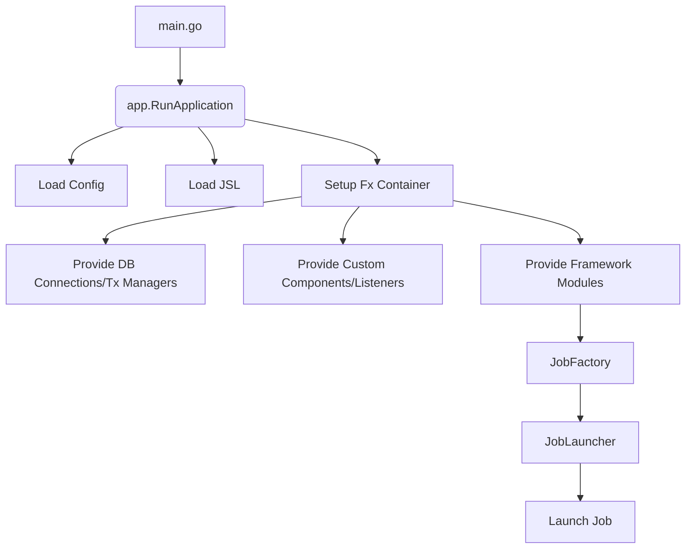

# Surfin バッチアプリケーションの作成ガイド

Surfin - Batch framework を使用してバッチアプリケーションを構築するための全体的なガイドです。
このドキュメントは、Surfin Batchの主要な概念から、JSL (Job Specification Language) によるジョブ定義、カスタムコンポーネントの実装、リスナーの活用、障害耐性、そしてアプリケーションの起動方法までを網羅的に説明します。

各セクションでは概要を説明し、より詳細な情報が必要な場合は、対応する詳細ガイドへのリンクを参照してください。

## 目次

1.  [主要概念](#1-主要概念)
2.  [プロジェクトのセットアップとJSL定義](#2-プロジェクトのセットアップとjsl定義)
3.  [カスタムコンポーネントの実装](#3-カスタムコンポーネントの実装)
4.  [リスナーによるライフサイクルイベントへの介入](#4-リスナーによるライフサイクルイベントへの介入)
5.  [障害耐性 (Fault Tolerance)](#5-障害耐性-fault-tolerance)
6.  [アプリケーションの起動](#6-アプリケーションの起動)

---

## 1. 主要概念

Surfin Batch Frameworkの基本的な概念と、ジョブの実行モデルについて理解します。

*   **詳細ガイド**: [1. 導入と主要概念](01_introduction.md)

## 2. プロジェクトのセットアップとJSL定義

Surfin Batchアプリケーションのプロジェクト構造、およびYAML形式でジョブフローを定義するJSL (Job Specification Language) の書き方について学びます。

*   **詳細ガイド**: [2. プロジェクトのセットアップとJSL定義](02_setup_and_jsl.md)

## 3. カスタムコンポーネントの実装

バッチ処理のビジネスロジックを実装するための主要なインターフェース（ItemReader, ItemProcessor, ItemWriter, Tasklet, Decision）について、その役割と実装方法を理解します。

*   **詳細ガイド**: [3. カスタムコンポーネントの実装](03_chunk_components.md)

## 4. リスナーによるライフサイクルイベントへの介入

ジョブやステップの様々なライフサイクルイベント（開始、終了、エラー発生など）にカスタムロジックを挿入するためのリスナー機能について学びます。

*   **詳細ガイド**: [5. リスナーの実装と登録](05_listeners.md)

## 5. 障害耐性 (Fault Tolerance)

Surfin Batch Frameworkが提供する、アイテムレベルのリトライ、スキップ、およびチャンク分割といった障害耐性機能について学びます。

*   **詳細ガイド**: [4. 障害耐性 (Fault Tolerance) とトランザクション管理](04_fault_tolerance.md)

## 6. アプリケーションの起動

Surfin Batchアプリケーションは、Goの `main` 関数から `app.RunApplication` を呼び出すことで起動します。この関数は、設定ファイル、JSL定義、そしてUber Fxによる依存性注入（DI）のためのオプションを受け取ります。


```mermaid
graph TD
    A[main.go] --> B(app.RunApplication)
    B --> C[Load Config]
    B --> D[Load JSL]
    B --> E[Setup Fx Container]
    E --> F[Provide DB Connections/Tx Managers]
    E --> G[Provide Custom Components/Listeners]
    E --> H[Provide Framework Modules]
    H --> I[JobFactory]
    I --> J[JobLauncher]
    J --> K[Launch Job]
```

**`main.go` の役割:**

1.  **コンテキストとシグナルハンドリング**: アプリケーションのライフサイクルを管理し、Ctrl+Cなどのシグナルを受信した際にジョブを安全に停止できるようにします。
2.  **設定ファイルの読み込み**: `application.yaml` や `job.yaml` などの設定ファイルを埋め込み（`go:embed`）またはファイルパスから読み込みます。
3.  **DBプロバイダの選択**: 環境変数などに基づいて、使用するデータベース（PostgreSQL, MySQL, SQLiteなど）のプロバイダを選択し、Fxに提供します。
4.  **`app.RunApplication` の呼び出し**: 読み込んだ設定と選択したDBプロバイダオプションを渡して、Surfin Batchアプリケーションを起動します。

**シンプルな `main.go` の構造:**

```go
// main.go の推奨構造
func main() {
    // ... (シグナルハンドリング等はそのまま)

    // app_options.go で定義した GetApplicationOptions を使用して起動
    app.RunApplication(
        ctx,
        ".env",
        config.EmbeddedConfig(embeddedConfig),
        jsl.JSLDefinitionBytes(embeddedJSL),
        nil,
        app.GetApplicationOptions(ctx, ".env", embeddedConfig, embeddedJSL), 
    )
}
```
