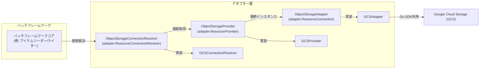

# Google Cloud Storage (GCS) アダプター 方式設計/基本設計書

## 1. はじめに

本設計書は、バッチフレームワークにおけるGoogle Cloud Storage (GCS) アダプターの導入に関する方式設計および基本設計を定義します。これにより、フレームワークがGCSと連携し、オブジェクトストレージ上のデータを効率的に処理できるようになることを目指します。

## 2. 目的

*   バッチフレームワークからGoogle Cloud Storageへのデータアクセスを可能にする。
*   ファイル（JSON, Parquetなど）のアップロード、ダウンロード、リスト、削除といった基本的なオブジェクトストレージ操作を提供する。
*   将来的な他のオブジェクトストレージサービス（Amazon S3, Azure Blob Storageなど）への拡張性を考慮し、`pkg/batch/core/adapter/interfaces.go` に定義されている汎用インターフェース (`ResourceConnection`, `ResourceProvider`, `ResourceConnectionResolver`) を活用した共通のインターフェースを導入する。

## 3. スコープ

GCSアダプターは、以下の機能を提供します。

*   指定されたGCSバケットへのデータのアップロード
*   指定されたGCSバケットからのデータのダウンロード
*   指定されたGCSバケット内のオブジェクトのリスト取得
*   指定されたGCSバケット内のオブジェクトの削除
*   GCSクライアントのリソース解放

## 4. 全体アーキテクチャにおける位置づけ

GCSアダプターは、バッチフレームワークの「アダプター層」に位置づけられます。
オブジェクトストレージ操作の汎用的な抽象化として `ObjectStorageAdapter` インターフェースを導入し、GCSアダプターはこのインターフェースを実装します。また、DBアダプターと同様に、接続の管理と解決のために `ObjectStorageProvider` および `ObjectStorageConnectionResolver` インターフェースを導入し、それぞれ `adapter.ResourceProvider` および `adapter.ResourceConnectionResolver` を埋め込みます。これにより、フレームワークのコアロジック（例: アイテムリーダー、アイテムライター）は、特定のクラウドプロバイダーに依存せず、共通のインターフェースを通じてオブジェクトストレージと連携できるようになります。



## 5. コンポーネント設計

### 5.1. 共通インターフェース定義

*   **ファイルパス**: `pkg/batch/adapter/storage/interfaces.go`
*   **パッケージ**: `storage`
*   **インターフェース**: `ObjectStorageAdapter`
    *   **目的**:
        *   汎用的なオブジェクトストレージ操作を定義する。
        *   `pkg/batch/core/adapter.ResourceConnection` インターフェースを埋め込むことで、汎用的なリソース接続としての機能（リソースタイプ、名前、クローズ）を提供する。
        *   これにより、具体的なストレージサービス（GCS, S3など）に依存しない形で、ファイル操作を行うことができる。
    *   **メソッド**:

        | メソッド名 | 説明 |
        |---|---|
        | `Close`        | アダプターが保持するリソース（例: 内部のクライアント接続）を解放します。(`adapter.ResourceConnection` から継承) |
        | `Type`         | リソースのタイプ（例: "gcs", "s3"）を返します。(`adapter.ResourceConnection` から継承) |
        | `Name`         | 接続名（例: "default", "archive"）を返します。(`adapter.ResourceConnection` から継承) |
        | `Upload`       | 指定されたバケットとオブジェクト名（パスを含む）にデータをアップロードします。`data` はアップロードするデータのストリームです。`contentType` はアップロードするデータのMIMEタイプを指定します。 |
        | `Download`     | 指定されたバケットとオブジェクト名（パスを含む）からデータをダウンロードします。ダウンロードしたデータのストリームを返します。このストリームは使用後に必ずクローズする必要があります。 |
        | `ListObjects`  | 指定されたバケットとプレフィックス内のオブジェクトをリストし、オブジェクト名をコールバック関数 `fn` に渡して逐次処理します。これにより、メモリ負荷を抑えつつ大量のオブジェクトを扱えます。 |
        | `DeleteObject` | 指定されたバケットとオブジェクト名を削除します。|
        | `Config`       | このアダプターが使用している設定（`pkg/batch/adapter/storage/config.StorageConfig`）を返します。|

*   **推奨されるインターフェース定義 (Go)**:

    ```go
    // pkg/batch/adapter/storage/interfaces.go (仮)

    package storage

    import (
        "context"
        "io"

        coreAdapter "github.com/tigerroll/surfin/pkg/batch/core/adapter"
        storageConfig "github.com/tigerroll/surfin/pkg/batch/adapter/storage/config"
    )

    // ObjectStorageAdapter は汎用的なオブジェクトストレージ操作を定義します。
    // coreAdapter.ResourceConnection を埋め込み、リソース接続としての機能を提供します。
    type ObjectStorageAdapter interface {
        coreAdapter.ResourceConnection // Close(), Type(), Name() を継承

        Upload(ctx context.Context, bucket, objectName string, data io.Reader, contentType string) error
        Download(ctx context.Context, bucket, objectName string) (io.ReadCloser, error)
        ListObjects(ctx context.Context, bucket, prefix string, fn func(objectName string) error) error
        DeleteObject(ctx context.Context, bucket, objectName string) error
        Config() storageConfig.StorageConfig
    }

    // ObjectStorageProvider はオブジェクトストレージ接続の取得と管理を行います。
    // coreAdapter.ResourceProvider を埋め込み、汎用的なプロバイダ機能を提供します。
    type ObjectStorageProvider interface {
        coreAdapter.ResourceProvider // GetConnection(), CloseAll(), Type() を継承

        // GetConnection は指定された名前の ObjectStorageAdapter 接続を取得します。
        GetConnection(name string) (ObjectStorageAdapter, error)
        // ForceReconnect は指定された名前の既存の接続を強制的に閉じ、再確立します。
        ForceReconnect(name string) (ObjectStorageAdapter, error)
    }

    // ObjectStorageConnectionResolver は実行コンテキストに基づいて適切なオブジェクトストレージ接続インスタンスを解決します。
    // coreAdapter.ResourceConnectionResolver を埋め込み、汎用的なリソース解決機能を提供します。
    type ObjectStorageConnectionResolver interface {
        coreAdapter.ResourceConnectionResolver // ResolveConnection(), ResolveConnectionName() を継承

        // ResolveObjectStorageConnection は指定された名前の ObjectStorageAdapter 接続インスタンスを解決します。
        // 返される接続が有効であり、必要に応じて再確立されることを保証します。
        ResolveObjectStorageConnection(ctx context.Context, name string) (ObjectStorageAdapter, error)

        // ResolveObjectStorageConnectionName は実行コンテキストに基づいてオブジェクトストレージ接続の名前を解決します。
        // jobExecution と stepExecution はモデルパッケージとの循環依存を避けるため interface{} として渡されます。
        ResolveObjectStorageConnectionName(ctx context.Context, jobExecution interface{}, stepExecution interface{}, defaultName string) (string, error)
    }
    ```

### 5.2. GCSアダプター実装

*   **ファイルパス**: `pkg/batch/adapter/storage/gcs/adapter.go` (GCSAdapter, GCSProvider, GCSConnectionResolver)
*   **パッケージ**: `gcs`

*   **実装構造体**: `gcsAdapter`
    *   **目的**: `ObjectStorageAdapter` インターフェースを実装し、GCSへの具体的な操作を提供します。
    *   **内部状態**: 内部に `*storage.Client` (Google Cloud Storage Go SDKのクライアント) と、`pkg/batch/adapter/storage/config.StorageConfig` を保持します。
    *   **実装インターフェース**: `ObjectStorageAdapter` (および `adapter.ResourceConnection`)
    *   **コンストラクタ**: `NewGCSAdapter(ctx context.Context, cfg storageConfig.StorageConfig, name string) (ObjectStorageAdapter, error)`
        *   このコンストラクタは、`GCSProvider` の内部で具体的な `gcsAdapter` インスタンスを生成するために使用されます。
        *   `pkg/batch/adapter/storage/config.StorageConfig` オブジェクトと、解決するストレージ接続の名前 (`name`) を受け取ります。
    *   **依存ライブラリ**: `cloud.google.com/go/storage`
    *   **新規依存ライブラリ**: `github.com/mitchellh/mapstructure` (設定のデコードのため)
    *   **メソッド実装**:

        | メソッド名 | 説明 |
        |---|---|
        | `Close` | 内部のGCSクライアントをクローズし、関連するリソースを解放します。 |
        | `Type` | "gcs" を返します。 |
        | `Name` | この接続の名前を返します。 |
        | `Upload` | GCS Go SDKの`Writer`オブジェクトを利用して、指定されたオブジェクト名（パスを含む）のGCSオブジェクトにデータストリームを書き込みます。 |
        | `Download` | GCS Go SDKの`Reader`オブジェクトを利用して、指定されたオブジェクト名（パスを含む）のGCSオブジェクトからデータストリームを読み込みます。 |
        | `ListObjects` | GCS Go SDKの`Objects`メソッドとイテレータ機能を利用して、指定されたバケットとプレフィックスに一致するオブジェクト名を列挙します。 |
        | `DeleteObject` | GCS Go SDKの`Delete`メソッドを利用して、GCSオブジェクトを削除します。 |
        | `Config` | アダプターが使用している `pkg/batch/adapter/storage/config.StorageConfig` を返します。 |

*   **実装構造体**: `GCSProvider`
    *   **目的**: `ObjectStorageProvider` インターフェースを実装し、GCS接続のライフサイクル管理（取得、再接続、クローズ）を行います。
    *   **内部状態**: アプリケーション全体の `config.Config` と、管理する `gcsAdapter` インスタンスのマップを保持します。
    *   **実装インターフェース**: `ObjectStorageProvider` (および `adapter.ResourceProvider`)
    *   **コンストラクタ**: `NewGCSProvider(cfg *config.Config) ObjectStorageProvider`
    *   **メソッド**: `GetConnection`, `ForceReconnect`, `CloseAll`, `Type` を実装します。`GetConnection` は、設定から `storageConfig.StorageConfig` をデコードし、`NewGCSAdapter` を呼び出して `gcsAdapter` インスタンスを生成・管理します。

*   **実装構造体**: `GCSConnectionResolver`
    *   **目的**: `ObjectStorageConnectionResolver` インターフェースを実装し、複数の `ObjectStorageProvider` (GCS, S3など) を管理し、要求された接続名に基づいて適切な `ObjectStorageAdapter` を解決する役割を担います。
    *   **内部状態**: `ObjectStorageProvider` のマップとアプリケーション全体の `config.Config` を保持します。
    *   **実装インターフェース**: `ObjectStorageConnectionResolver` (および `adapter.ResourceConnectionResolver`)
    *   **コンストラクタ**: `NewGCSConnectionResolver(providers []ObjectStorageProvider, cfg *config.Config) ObjectStorageConnectionResolver`
    *   **メソッド**: `ResolveConnection`, `ResolveConnectionName`, `ResolveObjectStorageConnection`, `ResolveObjectStorageConnectionName` を実装します。`ResolveObjectStorageConnection` は、設定から接続タイプを判断し、対応する `ObjectStorageProvider` を介して接続を取得します。

## 6. 認証・認可

GCSアダプターは、Google Cloud Storageへの認証に以下の方法をサポートします。

1.  **デフォルト認証（推奨）**:
    *   `pkg/batch/core/config/config.go` の `adapter_configs.storage.datasources.<name>.credentials_file` に空文字列 (`""`) を設定することで、Google Cloud Storage Go SDKが提供するデフォルトの認証メカニズムを利用します。
    *   これにより、Cloud Run、GKE、Compute EngineなどのGCP環境で実行される場合、インスタンスに紐付けられたサービスアカウントの権限が自動的に適用されます。
    *   ローカル開発環境では、`GOOGLE_APPLICATION_CREDENTIALS` 環境変数で指定されたサービスアカウントキーファイルが利用されます。

2.  **サービスアカウントキーファイルによる明示的な認証**:
    *   `pkg/batch/core/config/config.go` の `adapter_configs.storage.datasources.<name>.credentials_file` にサービスアカウントキー（JSON形式）のファイルパスを設定することで、指定されたサービスアカウントとして認証を行います。
    *   **シークレットマネージャーからのキー利用**: 
        *   シークレットマネージャー（例: Google Secret Manager）にサービスアカウントキーが格納されている場合、アプリケーション起動時にそのキーを取得し、一時ファイルとして保存した後、その一時ファイルのパスを `credentials_file` に渡すことで対応可能です。

## 7. 設定管理

オブジェクトストレージの設定は、`pkg/batch/core/config/config.go` の `surfin.adapter_configs.storage.datasources` 以下に定義されます。各ストレージ接続は名前で識別され、`pkg/batch/adapter/storage/config.StorageConfig` 構造体としてアダプター側で解釈されます。

```go
// pkg/batch/adapter/storage/config/config.go

package config

// StorageConfig holds configuration for a single object storage connection.
type StorageConfig struct {
	Type            string `yaml:"type"`             // Type of storage (e.g., "gcs", "s3").
	BucketName      string `yaml:"bucket_name"`      // Default bucket name for operations.
	CredentialsFile string `yaml:"credentials_file"` // Path to credentials file (e.g., service account key for GCS).
}

// DatasourcesConfig holds a map of named storage configurations.
type DatasourcesConfig map[string]StorageConfig
```

**YAML設定例:**
```yaml
surfin:
  # ... その他のフレームワーク共通設定
  adapter: # アダプターの設定
    storage: # ストレージアダプターの設定
      gcs: # database と同じで、任意の名称を指定できる
        type: gcs
        bucket_name: your-default-gcs-bucket
        credentials_file: "" # 空文字列の場合はデフォルト認証を使用
      s3:
        type: s3
        bucket_name: your-s3-bucket
        region: ap-northeast-1
        credentials_file: "/path/to/s3_credentials.json"
```

## 8. 考慮事項

*   **リソース管理**:
    *   `ObjectStorageAdapter` インターフェースの `Close()` メソッド（`adapter.ResourceConnection` から継承）を適切に実装し、GCSクライアントのリソースを確実に解放する必要があります。
    *   Fxライフサイクルと連携させ、アプリケーション終了時に `ObjectStorageProvider` の `CloseAll()` メソッドが呼び出されるようにします。
*   **エラーハンドリング**:
    *   設定のデコード失敗や、GCSクライアントの初期化失敗など、アダプターの初期化段階でのエラーハンドリングを適切に行う必要があります。

## 9. 課題と修正指針

本セクションでは、GCSアダプターの設計における具体的な課題と、それに対する修正指針を詳述します。

### 1. Parquet採用に伴うアップロードフロー

| 項目 | 説明 |
|---|---|
| **課題** | Parquetはファイル末尾にメタデータを書き込む特性があるため、<br/>全データが確定するまでGCSへの書き込みを完了できない。|
| **対策** | **■ バッファリング戦略** <br/> ・`ItemWriter` が `bytes.Buffer` や一時ファイルに一旦書き込むバッファリング戦略をとる。|
| **対策** | **■ アダプターへの受け渡し** <br/> ・完成したデータの `io.Reader` をアダプターの `Upload` に渡すフローを基本設計とする。|

### 2. リソース解放とエラーハンドリングの強化

| 項目 | 説明 |
|---|---|
| **課題** | 書き込み中のエラーにより、中途半端なオブジェクトが残る可能性がある。|
| **対策** | すべてのメソッドに `context.Context` を持たせ、Cloud Runのタイムアウトや<br/>中断時にSDKのWriterを適切にクローズ（キャンセル）できるようにする。|
