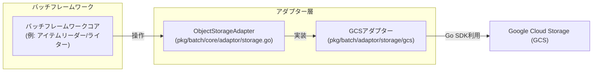

# Google Cloud Storage (GCS) アダプター 方式設計/基本設計書

## 1. はじめに

本設計書は、バッチフレームワークにおけるGoogle Cloud Storage (GCS) アダプターの導入に関する方式設計および基本設計を定義します。これにより、フレームワークがGCSと連携し、オブジェクトストレージ上のデータを効率的に処理できるようになることを目指します。

## 2. 目的

*   バッチフレームワークからGoogle Cloud Storageへのデータアクセスを可能にする。
*   ファイル（JSON, Parquetなど）のアップロード、ダウンロード、リスト、削除といった基本的なオブジェクトストレージ操作を提供する。
*   将来的な他のオブジェクトストレージサービス（Amazon S3, Azure Blob Storageなど）への拡張性を考慮し、共通のインターフェースを導入する。

## 3. スコープ

GCSアダプターは、以下の機能を提供します。

*   指定されたGCSバケットへのデータのアップロード
*   指定されたGCSバケットからのデータのダウンロード
*   指定されたGCSバケット内のオブジェクトのリスト取得
*   指定されたGCSバケット内のオブジェクトの削除
*   GCSクライアントのリソース解放

## 4. 全体アーキテクチャにおける位置づけ

GCSアダプターは、バッチフレームワークの「アダプター層」に位置づけられます。
オブジェクトストレージ操作の汎用的な抽象化として `ObjectStorageAdapter` インターフェースを導入し、GCSアダプターはこのインターフェースを実装します。これにより、フレームワークのコアロジック（例: アイテムリーダー、アイテムライター）は、特定のクラウドプロバイダーに依存せず、共通のインターフェースを通じてオブジェクトストレージと連携できるようになります。



## 5. コンポーネント設計

### 5.1. 共通インターフェース定義

*   **ファイルパス**: `pkg/batch/core/adaptor/storage.go`
*   **パッケージ**: `adaptor`
*   **インターフェース**: `ObjectStorageAdapter`
    *   **目的**: 
        *   汎用的なオブジェクトストレージ操作を定義する。
        *   これにより、具体的なストレージサービス（GCS, S3など）に依存しない形で、ファイル操作を行うことができる。
    *   **メソッド**:

        | メソッド名 | 説明 |
        |---|---|
        | `Upload`       | 指定されたバケットとオブジェクト名にデータをアップロードします。`data` はアップロードするデータのストリームです。|
        | `Download`     | 指定されたバケットとオブジェクト名からデータをダウンロードします。ダウンロードしたデータのストリームを返します。このストリームは使用後に必ずクローズする必要があります。|
        | `ListObjects`  | 指定されたバケットとプレフィックス内のオブジェクトをリストし、オブジェクト名のリストを返します。|
        | `DeleteObject` | 指定されたバケットとオブジェクト名を削除します。|
        | `Close`        | アダプターが保持するリソース（例: 内部のクライアント接続）を解放します。|
        | `Config`       | このアダプターが使用している設定（`pkg/batch/adaptor/storage/config.StorageConfig`）を返します。|

### 5.2. GCSアダプター実装

*   **ファイルパス**: `pkg/batch/adaptor/storage/gcs/adapter.go`
*   **パッケージ**: `gcs`
*   **実装構造体**: `gcsAdapter`
    *   内部に `*storage.Client` (Google Cloud Storage Go SDKのクライアント) と、`pkg/batch/adaptor/storage/config.StorageConfig` を保持します。
*   **コンストラクタ**: `NewGCSAdapter(ctx context.Context, cfg *config.Config, name string) (adaptor.ObjectStorageAdapter, error)`
    *   アプリケーション全体の `config.Config` オブジェクトと、解決するストレージ接続の名前 (`name`) を受け取ります。
    *   `config.Config` から、指定された名前のストレージ接続設定を抽出し、`pkg/batch/adaptor/storage/config.StorageConfig` にデコードして利用します。
*   **依存ライブラリ**: `cloud.google.com/go/storage`
    *   **新規依存ライブラリ**: `github.com/mitchellh/mapstructure` (設定のデコードのため)
    *   **メソッド実装**:

        | メソッド名 | 説明 |
        |---|---|
        | `Upload` | GCS Go SDKの`Writer`オブジェクトを利用して、データストリームをGCSオブジェクトに書き込みます。**HIVEパーティショニングが有効な場合、`objectName`の生成ロジックにHIVEパーティションのパスを含めることを考慮します。** |
        | `Download` | GCS Go SDKの`Reader`オブジェクトを利用して、GCSオブジェクトからデータストリームを読み込みます。**HIVEパーティショニングが有効な場合、`objectName`の解決ロジックにHIVEパーティションのパスを含めることを考慮します。** |
        | `ListObjects` | GCS Go SDKの`Objects`メソッドとイテレータ機能を利用して、指定されたバケットとプレフィックスに一致するオブジェクト名を列挙します。**HIVEパーティショニングが有効な場合、`prefix`の解釈ロジックにHIVEパーティションのパスを含めることを考慮します。** |
        | `DeleteObject` | GCS Go SDKの`Delete`メソッドを利用して、GCSオブジェクトを削除します。**HIVEパーティショニングが有効な場合、`objectName`の解決ロジックにHIVEパーティションのパスを含めることを考慮します。** |
        | `Close` | 内部のGCSクライアントをクローズし、関連するリソースを解放します。 |
        | `Config` | アダプターが使用している `pkg/batch/adaptor/storage/config.StorageConfig` を返します。 |

## 6. 認証・認可

GCSアダプターは、Google Cloud Storageへの認証に以下の方法をサポートします。

1.  **デフォルト認証（推奨）**:
    *   `pkg/batch/core/config/config.go` の `adaptor_configs.storage.datasources.<name>.credentials_file` に空文字列 (`""`) を設定することで、Google Cloud Storage Go SDKが提供するデフォルトの認証メカニズムを利用します。
    *   これにより、Cloud Run、GKE、Compute EngineなどのGCP環境で実行される場合、インスタンスに紐付けられたサービスアカウントの権限が自動的に適用されます。
    *   ローカル開発環境では、`GOOGLE_APPLICATION_CREDENTIALS` 環境変数で指定されたサービスアカウントキーファイルが利用されます。

2.  **サービスアカウントキーファイルによる明示的な認証**:
    *   `pkg/batch/core/config/config.go` の `adaptor_configs.storage.datasources.<name>.credentials_file` にサービスアカウントキー（JSON形式）のファイルパスを設定することで、指定されたサービスアカウントとして認証を行います。
    *   **シークレットマネージャーからのキー利用**: 
        *   シークレットマネージャー（例: Google Secret Manager）にサービスアカウントキーが格納されている場合、アプリケーション起動時にそのキーを取得し、一時ファイルとして保存した後、その一時ファイルのパスを `credentials_file` に渡すことで対応可能です。

## 7. 設定管理とHIVEパーティショニング

オブジェクトストレージの設定は、`pkg/batch/core/config/config.go` の `surfin.adaptor_configs.storage.datasources` 以下に定義されます。各ストレージ接続は名前で識別され、`pkg/batch/adaptor/storage/config.StorageConfig` 構造体としてアダプター側で解釈されます。

`pkg/batch/adaptor/storage/config/config.go` で定義される `StorageConfig` および `HivePartitionConfig` は以下の通りです。

```go
// pkg/batch/adaptor/storage/config/config.go

package config

// HivePartitionConfig holds configuration for Hive partitioning.
type HivePartitionConfig struct {
	EnableHivePartitioning    bool   `yaml:"enable_hive_partitioning"`     // Whether to enable Hive partitioning.
	HivePartitionPrefixFormat string `yaml:"hive_partition_prefix_format"` // Format string for Hive partition prefixes (e.g., "year=%Y/month=%m/day=%d").
}

// StorageConfig holds configuration for a single object storage connection.
type StorageConfig struct {
	Type            string              `yaml:"type"`             // Type of storage (e.g., "gcs", "s3").
	BucketName      string              `yaml:"bucket_name"`      // Default bucket name for operations.
	CredentialsFile string              `yaml:"credentials_file"` // Path to credentials file (e.g., service account key for GCS).
	HivePartition   HivePartitionConfig `yaml:"hive_partition"`   // Hive partitioning settings.
}

// DatasourcesConfig holds a map of named storage configurations.
type DatasourcesConfig map[string]StorageConfig
```

HIVEパーティショニングに関する設定も `StorageConfig` 内に含められ、`enable_hive_partitioning` (bool) と `hive_partition_prefix_format` (string) で制御されます。これにより、アダプターは設定に基づいてHIVEパーティションのパスを動的に生成・解釈できるようになります。

**YAML設定例:**
```yaml
surfin:
  # ... その他のフレームワーク共通設定
  adaptor_configs:
    storage: # ストレージアダプターの設定
      datasources:
        default_gcs:
          type: gcs
          bucket_name: your-default-gcs-bucket
          credentials_file: "" # 空文字列の場合はデフォルト認証を使用
          hive_partition:
            enable_hive_partitioning: true
            hive_partition_prefix_format: "year=%Y/month=%m/day=%d" # 例: year=2023/month=10/day=26
        another_s3_connection:
          type: s3
          bucket_name: your-s3-bucket
          region: ap-northeast-1
          credentials_file: "/path/to/s3_credentials.json"
          hive_partition:
            enable_hive_partitioning: false # S3ではHIVEパーティションを無効にする例
            hive_partition_prefix_format: ""
```

## 8. 考慮事項

*   **リソース管理**: 
    *   `ObjectStorageAdapter` インターフェースの `Close()` メソッドを適切に実装し、GCSクライアントのリソースを確実に解放する必要があります。
    *   Fxライフサイクルと連携させることを検討します。
*   **HIVEパーティションパスの生成/解釈**:
    *   `Upload`、`Download`、`ListObjects`、`DeleteObject` メソッド内で、`HivePartitionConfig` の設定に基づいて、オブジェクト名やプレフィックスを動的に構築または解釈するロジックを実装する必要があります。`hive_partition_prefix_format` は `time.Format` のような形式文字列を想定しています。
*   **エラーハンドリング**:
    *   設定のデコード失敗や、GCSクライアントの初期化失敗など、アダプターの初期化段階でのエラーハンドリングを適切に行う必要があります。
