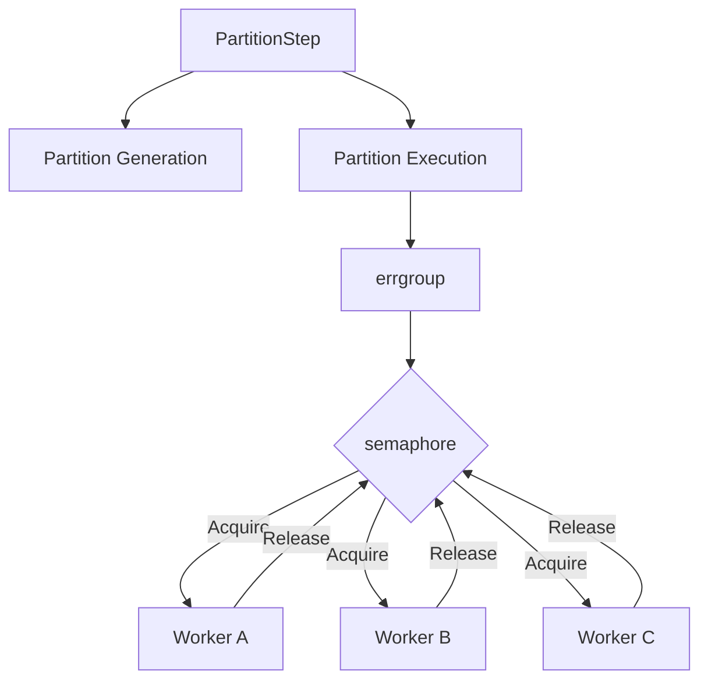
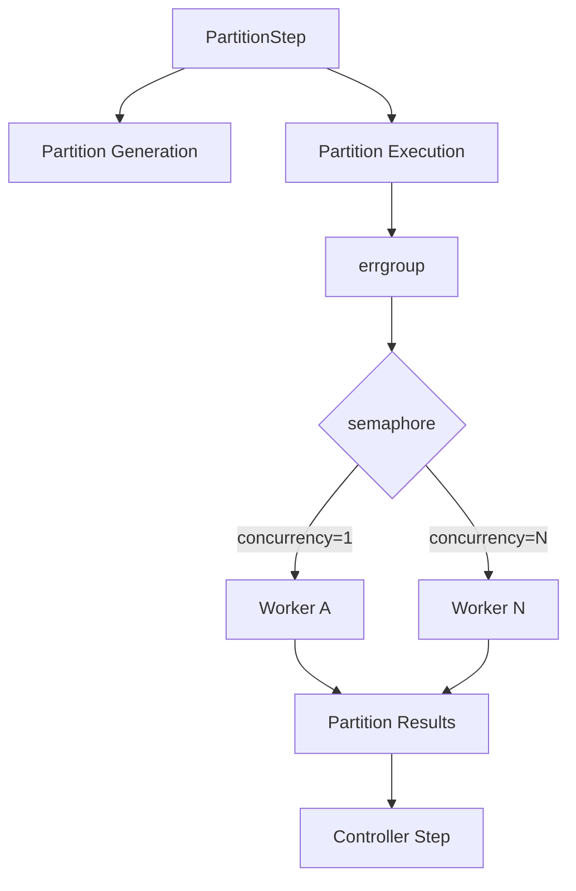

# Partition Execution Strategy

## 1. 目的
Surfin の `PartitionStep` は、1つの Step を複数の Partition に分割し、それぞれを独立した Worker として実行する。現在の実装では `StepExecutor` インターフェースにより「実行場所（ローカル/リモート）」の抽象化は実現されているが、並行実行の制御ロジックをより Go らしいシンプルな構造に刷新する。

本戦略により、以下の目的を達成する。
* Partition 数が多い場合でもリソース使用量を制御できるようにする
* Partition 間の並行実行数を設定可能にする
* Go の concurrency primitive (`errgroup`, `semaphore`) を活用し、複雑な Executor 階層を避ける

## 2. 設計原則 (Design Principles)

Surfin の Partition Execution は以下の原則に従う。

1.  **Serial First (Safety First)**: 外部APIのレートリミットやDB負荷を考慮し、デフォルトでは直列実行（Serial）を推奨する。並列実行はスループット向上のための「オプション」として位置づける。
2.  **意味論の不変性 (Semantics Preservation)**: リファクタリング前後でジョブの実行結果や障害時の振る舞い（Failure Matrix）を一切変更しない。
3.  **Go らしい並行処理**: Goroutine は「並行実行（Concurrency）」の基本単位であり、これを Go の primitive (`errgroup`, `semaphore`) で制御する。独自 Executor 階層を増やす抽象化は行わない。
4.  **Failure Matrix を実行仕様とする**: 障害対応の振る舞いはドキュメントだけでなく、テストコード（Executable Specification）として実装し、常に検証可能にする。

## 3. アーキテクチャの分離
「実行場所」と「並行実行制御」を明確に分離する。

* **Execution Location (Where)**: `port.StepExecutor` インターフェースが担う。
    * `SimpleStepExecutor`: ローカル環境での実行。
    * `RemoteStepExecutor`: リモート環境への委譲。
* **Concurrency Control (How)**: `PartitionStep` 内部のループ処理が担う。
    * `concurrency` 設定値に基づき、`semaphore` で同時実行数を制限する。

## 4. Go らしい Partition Execution
`PartitionStep` は独自の非同期実行モデルを作るのではなく、Go が提供する concurrency primitive を組み合わせる。

### 4.1. 実装モデル
```go
sem := semaphore.NewWeighted(int64(maxConcurrency))
g, ctx := errgroup.WithContext(ctx)

for name, executionContext := range partitions {
    g.Go(func() error {
        if err := sem.Acquire(ctx, 1); err != nil { return err }
        defer sem.Release(1)
        
        // StepExecutor を介して実行（ローカル/リモートを意識しない）
        _, err := s.stepExecutor.ExecuteStep(ctx, s.workerStep, jobExecution, workerExec)
        return err
    })
}
return g.Wait()
```

### 4.2. 並行実行制御フロー


### 4.3. 使用する primitive
| Primitive | 役割 |
| :--- | :--- |
| `context.Context` | cancellation / deadline の伝播 |
| `errgroup` | goroutine のライフサイクルとエラー集約 |
| `semaphore` | Partition の並行実行数の制限 |
| goroutine | Partition Worker の並行実行 |

## 5. Serial Execution の扱い
Serial Execution は独立した Executor 型として実装しない。
`concurrency = 1` を設定することで、Partition を1つずつ実行する。これにより、同じ Execution Model の中で実行環境に応じた並行実行数を選択できる。

## 6. Partition Failure Semantics
Partition Execution では、Worker ごとに独立した実行結果が発生する。Controller Step は、`errgroup` から返されるエラーと、各 Worker の `StepExecution` 状態を集約し、最終的な状態を決定する。

* **Cancellation**: 1つの Partition が致命的なエラーを返した場合、`errgroup` と `context.Context` を利用して他の Partition に cancellation を伝播する。
* **Restart**: 各 Partition は独立した `StepExecution` を持つため、失敗した Partition のみを特定して再実行可能な状態を維持する。

## 7. Failure Matrix (Executable Specification)
Partition Execution の状態・失敗パターンを Failure Matrix として整理し、テストコードで検証する。

| 状況 | Worker | Controller | Restart |
| :--- | :--- | :--- | :--- |
| 全 Partition 成功 | COMPLETE | COMPLETE | 不要 |
| 一部 Partition 失敗 | FAILED | FAILED | 必要 |
| Context cancellation | STOPPED | STOPPED | 必要 |

## 8. Implementation Roadmap

### Phase 1 — リファクタリング（意味論の維持）
* 既存の `StepExecutor` インターフェースを維持し、実行場所の切り替え機能はそのまま活用する。
* `PartitionStep` 内の `sync.WaitGroup` を `errgroup` に置き換え、エラー集約を簡素化する。
* **制約**: 挙動を一切変えないこと。Failure Matrix に影響を与えないことを最優先とする。

### Phase 2 — Concurrency Control の導入
* `maxConcurrency` 設定を導入。
* `semaphore` によるリソース制御を実装。
* `concurrency = 1` による Serial Execution の動作確認。

### Phase 3 — Partition Execution Semantics の確立
* Worker の状態遷移、Partial Failure、Cancellation、Restart の挙動を明文化し、テストコードで網羅する。

### Phase 4 — Observability
* Execution Semantics 確立後、OpenTelemetry を用いて Partition 単位のメトリクス（実行時間、並行数、成功/失敗）を追加する。

## 9. Summary
Surfin の Partition Execution は、Java/Spring の Executor/Strategy Pattern をそのまま Go に移植するのではなく、**JSR-352 の Partitioning が持つ実行意味論を維持しながら、Go の concurrency model で実装する**ことを基本方針とする。


