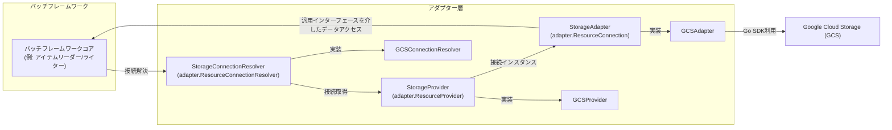

# Storage Adapter 方式設計/基本設計書

## 1. はじめに

本設計書は、バッチフレームワークにおけるGoogle Cloud Storage (GCS) アダプターの導入に関する方式設計および基本設計を定義します。これにより、フレームワークがGCSと連携し、データストレージ上のデータを効率的に処理できるようになることを目指します。

## 2. 目的

*   バッチフレームワークからGoogle Cloud Storageへのデータアクセスを可能にする。
*   ファイル（JSON, Parquetなど）のアップロード、ダウンロード、リスト、削除といった基本的なデータストレージ操作を提供する。
*   将来的な他のデータストレージサービス（Amazon S3, Azure Blob Storage, ローカルファイルシステム, FTP/SFTP, データベースのBLOB/CLOBストレージなど）への拡張性を考慮し、`pkg/batch/core/adapter/interfaces.go` に定義されている汎用インターフェース (`ResourceConnection`, `ResourceProvider`, `ResourceConnectionResolver`) を活用した共通のインターフェースを導入する。
*   これにより、バッチフレームワークのアイテムリーダーやアイテムライターといったコアコンポーネントが、特定のストレージ実装（GCS、ローカルファイルシステムなど）に依存せず、共通のインターフェースを通じてデータにアクセスできるようになることを目指します。

## 3. スコープ

GCSアダプターは、以下の機能を提供します。

*   指定されたGCSバケットへのデータのアップロード
*   指定されたGCSバケットからのデータのダウンロード
*   指定されたGCSバケット内のオブジェクトのリスト取得
*   指定されたGCSバケット内のオブジェクトの削除
*   GCSクライアントのリソース解放

## 4. 全体アーキテクチャにおける位置づけ

GCSアダプターは、バッチフレームワークの「アダプター層」に位置づけられます。
データストレージ操作の汎用的な抽象化として `StorageAdapter` インターフェースを導入し、GCSアダプターはこのインターフェースを実装します。また、DBアダプターと同様に、接続の管理と解決のために `StorageProvider` および `StorageConnectionResolver` インターフェースを導入し、それぞれ `adapter.ResourceProvider` および `adapter.ResourceConnectionResolver` を埋め込みます。これにより、フレームワークのコアロジック（例: アイテムリーダー、アイテムライター）は、特定のストレージプロバイダーに依存せず、共通のインターフェースを通じてデータストレージと連携できるようになります。



## 5. コンポーネント設計

### 5.1. 共通インターフェース定義

*   **ファイルパス**: `pkg/batch/adapter/storage/interfaces.go`
*   **パッケージ**: `storage`
*   **インターフェース**: `StorageAdapter`
    *   **目的**:
        *   汎用的なストレージ操作を定義する。
        *   `pkg/batch/core/adapter.ResourceConnection` インターフェースを埋め込むことで、汎用的なリソース接続としての機能（リソースタイプ、名前、クローズ）を提供する。
        *   これにより、具体的なストレージサービス（GCS, S3, ローカルファイルシステムなど）に依存しない形で、ファイル操作を行うことができる。
    *   **メソッド**:

        | メソッド名 | 説明 |
        |---|---|
        | `Close`        | アダプターが保持するリソース（例: 内部のクライアント接続）を解放します。(`adapter.ResourceConnection` から継承) |
        | `Type`         | リソースのタイプ（例: "gcs", "s3"）を返します。(`adapter.ResourceConnection` から継承) |
        | `Name`         | 接続名（例: "default", "archive"）を返します。(`adapter.ResourceConnection` から継承) |
        | `Upload`       | 指定されたバケットとオブジェクト名（パスを含む）にデータをアップロードします。`data` はアップロードするデータのストリームです。`contentType` はアップロードするデータのMIMEタイプを指定します。 |
        | `Download`     | 指定されたバケットとオブジェクト名（パスを含む）からデータをダウンロードします。ダウンロードしたデータのストリームを返します。このストリームは使用後に必ずクローズする必要があります。 |
        | `ListObjects`  | 指定されたバケットとプレフィックス内のオブジェクトをリストし、オブジェクト名をコールバック関数 `fn` に渡して逐次処理します。これにより、メモリ負荷を抑えつつ大量のオブジェクトを扱えます。 |
        | `DeleteObject` | 指定されたバケットとオブジェクト名を削除します。|
        | `Config`       | このアダプターが使用している設定（`pkg/batch/adapter/storage/config.StorageConfig`）を返します。|

*   **推奨されるインターフェース定義 (Go)**:

    ```go
    // pkg/batch/adapter/storage/interfaces.go (仮)

    package storage

    import (
        "context"
        "io"

        coreAdapter "github.com/tigerroll/surfin/pkg/batch/core/adapter"
        storageConfig "github.com/tigerroll/surfin/pkg/batch/adapter/storage/config"
    )

    // StorageAdapter は汎用的なデータストレージ操作を定義します。
    // coreAdapter.ResourceConnection を埋め込み、リソース接続としての機能を提供します。
    type StorageAdapter interface {
        coreAdapter.ResourceConnection // Close(), Type(), Name() を継承

        Upload(ctx context.Context, bucket, objectName string, data io.Reader, contentType string) error
        Download(ctx context.Context, bucket, objectName string) (io.ReadCloser, error)
        ListObjects(ctx context.Context, bucket, prefix string, fn func(objectName string) error) error
        DeleteObject(ctx context.Context, bucket, objectName string) error
        Config() storageConfig.StorageConfig
    }

    // StorageProvider はデータストレージ接続の取得と管理を行います。
    // coreAdapter.ResourceProvider を埋め込み、汎用的なプロバイダ機能を提供します。
    type StorageProvider interface {
        coreAdapter.ResourceProvider // GetConnection(), CloseAll(), Type() を継承

        // GetConnection は指定された名前の StorageAdapter 接続を取得します。
        GetConnection(name string) (StorageAdapter, error)
        // ForceReconnect は指定された名前の既存の接続を強制的に閉じ、再確立します。
        ForceReconnect(name string) (StorageAdapter, error)
    }

    // StorageConnectionResolver は実行コンテキストに基づいて適切なデータストレージ接続インスタンスを解決します。
    // coreAdapter.ResourceConnectionResolver を埋め込み、汎用的なリソース解決機能を提供します。
    type StorageConnectionResolver interface {
        coreAdapter.ResourceConnectionResolver // ResolveConnection(), ResolveConnectionName() を継承

        // ResolveStorageConnection は指定された名前の StorageAdapter 接続インスタンスを解決します。
        // 返される接続が有効であり、必要に応じて再確立されることを保証します。
        ResolveStorageConnection(ctx context.Context, name string) (StorageAdapter, error)

        // ResolveStorageConnectionName は実行コンテキストに基づいてデータストレージ接続の名前を解決します。
        // jobExecution と stepExecution はモデルパッケージとの循環依存を避けるため interface{} として渡されます。
        ResolveStorageConnectionName(ctx context.Context, jobExecution interface{}, stepExecution interface{}, defaultName string) (string, error)
    }
    ```

### 5.2. GCSアダプター実装

*   **ファイルパス**: `pkg/batch/adapter/storage/gcs/adapter.go` (GCSAdapter, GCSProvider, GCSConnectionResolver)
*   **パッケージ**: `gcs`

*   **実装構造体**: `gcsAdapter`
    *   **目的**: `StorageAdapter` インターフェースを実装し、GCSへの具体的な操作を提供します。
    *   **内部状態**: 内部に `*storage.Client` (Google Cloud Storage Go SDKのクライアント) と、`pkg/batch/adapter/storage/config.StorageConfig` を保持します。
    *   **実装インターフェース**: `StorageAdapter` (および `adapter.ResourceConnection`)
    *   **コンストラクタ**: `NewGCSAdapter(ctx context.Context, cfg storageConfig.StorageConfig, name string) (StorageAdapter, error)`
        *   このコンストラクタは、`GCSProvider` の内部で具体的な `gcsAdapter` インスタンスを生成するために使用されます。
        *   `pkg/batch/adapter/storage/config.StorageConfig` オブジェクトと、解決するストレージ接続の名前 (`name`) を受け取ります。
    *   **依存ライブラリ**: `cloud.google.com/go/storage`
    *   **新規依存ライブラリ**: `github.com/mitchellh/mapstructure` (設定のデコードのため)
    *   **メソッド実装**:

        | メソッド名 | 説明 |
        |---|---|
        | `Close` | 内部のGCSクライアントをクローズし、関連するリソースを解放します。 |
        | `Type` | "gcs" を返します。 |
        | `Name` | この接続の名前を返します。 |
        | `Upload` | GCS Go SDKの`Writer`オブジェクトを利用して、指定されたオブジェクト名（パスを含む）のGCSオブジェクトにデータストリームを書き込みます。 |
        | `Download` | GCS Go SDKの`Reader`オブジェクトを利用して、指定されたオブジェクト名（パスを含む）のGCSオブジェクトからデータストリームを読み込みます。 |
        | `ListObjects` | GCS Go SDKの`Objects`メソッドとイテレータ機能を利用して、指定されたバケットとプレフィックスに一致するオブジェクト名を列挙します。 |
        | `DeleteObject` | GCS Go SDKの`Delete`メソッドを利用して、GCSオブジェクトを削除します。 |
        | `Config` | アダプターが使用している `pkg/batch/adapter/storage/config.StorageConfig` を返します。 |

*   **実装構造体**: `GCSProvider`
    *   **目的**: `StorageProvider` インターフェースを実装し、GCS接続のライフサイクル管理（取得、再接続、クローズ）を行います。
    *   **内部状態**: アプリケーション全体の `config.Config` と、管理する `gcsAdapter` インスタンスのマップを保持します。
    *   **実装インターフェース**: `StorageProvider` (および `adapter.ResourceProvider`)
    *   **コンストラクタ**: `NewGCSProvider(cfg *config.Config) StorageProvider`
    *   **メソッド**: `GetConnection`, `ForceReconnect`, `CloseAll`, `Type` を実装します。`GetConnection` は、設定から `storageConfig.StorageConfig` をデコードし、`NewGCSAdapter` を呼び出して `gcsAdapter` インスタンスを生成・管理します。

*   **実装構造体**: `GCSConnectionResolver`
    *   **目的**: `StorageConnectionResolver` インターフェースを実装し、複数の `StorageProvider` (GCS, S3, local など) を管理し、要求された接続名に基づいて適切な `StorageAdapter` を解決する役割を担います。
    *   **内部状態**: `StorageProvider` のマップとアプリケーション全体の `config.Config` を保持します。
    *   **実装インターフェース**: `StorageConnectionResolver` (および `adapter.ResourceConnectionResolver`)
    *   **コンストラクタ**: `NewGCSConnectionResolver(providers []StorageProvider, cfg *config.Config) StorageConnectionResolver`
    *   **メソッド**: `ResolveConnection`, `ResolveConnectionName`, `ResolveStorageConnection`, `ResolveStorageConnectionName` を実装します。`ResolveStorageConnection` は、設定から接続タイプを判断し、対応する `StorageProvider` を介して接続を取得します。

### 5.3. ローカルファイルシステムアダプター実装

*   **ファイルパス**: `pkg/batch/adapter/storage/local/adapter.go` (LocalAdapter, LocalProvider, LocalConnectionResolver)
*   **パッケージ**: `local`

*   **実装構造体**: `localAdapter`
    *   **目的**: `StorageAdapter` インターフェースを実装し、ローカルファイルシステムへの具体的な操作を提供します。
    *   **内部状態**: `pkg/batch/adapter/storage/config.StorageConfig` を保持し、特に `BaseDir` を利用してファイル操作を行います。
    *   **実装インターフェース**: `StorageAdapter` (および `adapter.ResourceConnection`)
    *   **コンストラクタ**: `NewLocalAdapter(cfg storageConfig.StorageConfig, name string) (StorageAdapter, error)`
        *   このコンストラクタは、`LocalProvider` の内部で具体的な `localAdapter` インスタンスを生成するために使用されます。
        *   `pkg/batch/adapter/storage/config.StorageConfig` オブジェクトと、解決するストレージ接続の名前 (`name`) を受け取ります。
        *   `BaseDir` が指定されていない場合や無効なパスの場合にはエラーを返すようにします。
    *   **依存ライブラリ**: 標準の `os`, `path/filepath`, `io` パッケージなど。
    *   **メソッド実装**:

        | メソッド名 | 説明 |
        |---|---|
        | `Close` | ローカルファイルシステムアダプターは特別なリソースを保持しないため、何もしません。 |
        | `Type` | "local" を返します。 |
        | `Name` | この接続の名前を返します。 |
        | `Upload` | 指定されたバケット（ローカルではディレクトリとして扱われる）とオブジェクト名（ファイルパス）にデータを書き込みます。`BaseDir` を基準とした相対パスとしてファイルを生成します。必要に応じてディレクトリを作成します。 |
        | `Download` | 指定されたバケットとオブジェクト名からデータを読み込みます。`BaseDir` を基準とした相対パスとしてファイルを読み込みます。 |
        | `ListObjects` | 指定されたバケットとプレフィックス内のファイルをリストし、ファイル名をコールバック関数 `fn` に渡して逐次処理します。`BaseDir` を基準とした相対パスとしてディレクトリを走査します。 |
        | `DeleteObject` | 指定されたバケットとオブジェクト名を削除します。`BaseDir` を基準とした相対パスとしてファイルを削除します。 |
        | `Config` | アダプターが使用している `pkg/batch/adapter/storage/config.StorageConfig` を返します。 |

*   **実装構造体**: `LocalProvider`
    *   **目的**: `StorageProvider` インターフェースを実装し、ローカルファイルシステム接続のライフサイクル管理（取得、再接続、クローズ）を行います。
    *   **内部状態**: アプリケーション全体の `config.Config` と、管理する `localAdapter` インスタンスのマップを保持します。
    *   **実装インターフェース**: `StorageProvider` (および `adapter.ResourceProvider`)
    *   **コンストラクタ**: `NewLocalProvider(cfg *config.Config) StorageProvider`
    *   **メソッド**: `GetConnection`, `ForceReconnect`, `CloseAll`, `Type` を実装します。`GetConnection` は、設定から `storageConfig.StorageConfig` をデコードし、`NewLocalAdapter` を呼び出して `localAdapter` インスタンスを生成・管理します。

*   **実装構造体**: `LocalConnectionResolver`
    *   **目的**: `StorageConnectionResolver` インターフェースを実装し、複数の `StorageProvider` (GCS, S3, local など) を管理し、要求された接続名に基づいて適切な `StorageAdapter` を解決する役割を担います。
    *   **内部状態**: `StorageProvider` のマップとアプリケーション全体の `config.Config` を保持します。
    *   **実装インターフェース**: `StorageConnectionResolver` (および `adapter.ResourceConnectionResolver`)
    *   **コンストラクタ**: `NewLocalConnectionResolver(providers []StorageProvider, cfg *config.Config) StorageConnectionResolver`
    *   **メソッド**: `ResolveConnection`, `ResolveConnectionName`, `ResolveStorageConnection`, `ResolveStorageConnectionName` を実装します。`ResolveStorageConnection` は、設定から接続タイプを判断し、対応する `StorageProvider` を介して接続を取得します。

## 6. 認証・認可

GCSアダプターは、Google Cloud Storageへの認証に以下の方法をサポートします。

1.  **デフォルト認証（推奨）**:
    *   `pkg/batch/core/config/config.go` の `adapter_configs.storage.datasources.<name>.credentials_file` に空文字列 (`""`) を設定することで、Google Cloud Storage Go SDKが提供するデフォルトの認証メカニズムを利用します。
    *   これにより、Cloud Run、GKE、Compute EngineなどのGCP環境で実行される場合、インスタンスに紐付けられたサービスアカウントの権限が自動的に適用されます。
    *   ローカル開発環境では、`GOOGLE_APPLICATION_CREDENTIALS` 環境変数で指定されたサービスアカウントキーファイルが利用されます。

2.  **サービスアカウントキーファイルによる明示的な認証**:
    *   `pkg/batch/core/config/config.go` の `adapter_configs.storage.datasources.<name>.credentials_file` にサービスアカウントキー（JSON形式）のファイルパスを設定することで、指定されたサービスアカウントとして認証を行います。
    *   **シークレットマネージャーからのキー利用**: 
        *   シークレットマネージャー（例: Google Secret Manager）にサービスアカウントキーが格納されている場合、アプリケーション起動時にそのキーを取得し、一時ファイルとして保存した後、その一時ファイルのパスを `credentials_file` に渡すことで対応可能です。

## 7. 設定管理

オブジェクトストレージの設定は、`pkg/batch/core/config/config.go` の `surfin.adapter_configs.storage.datasources` 以下に定義されます。各ストレージ接続は名前で識別され、`pkg/batch/adapter/storage/config.StorageConfig` 構造体としてアダプター側で解釈されます。

```go
// pkg/batch/adapter/storage/config/config.go

package config

// StorageConfig holds configuration for a single storage connection.
type StorageConfig struct {
	Type            string `yaml:"type"`             // Type of storage (e.g., "gcs", "s3", "local", "ftp", "sftp").
	BucketName      string `yaml:"bucket_name"`      // Default bucket name for operations.
	CredentialsFile string `yaml:"credentials_file"` // Path to credentials file (e.g., service account key for GCS).
	BaseDir         string `yaml:"base_dir"`         // Base directory for local file system operations.
}

// DatasourcesConfig holds a map of named storage configurations.
type DatasourcesConfig map[string]StorageConfig
```

**YAML設定例:**
```yaml
surfin:
  # ... その他のフレームワーク共通設定
  adapter: # アダプターの設定
    storage: # データストレージアダプターの設定
      gcs: # database と同じで、任意の名称を指定できる
        type: gcs
        bucket_name: your-default-gcs-bucket
        credentials_file: "" # 空文字列の場合はデフォルト認証を使用
      s3:
        type: s3
        bucket_name: your-s3-bucket
        region: ap-northeast-1
        credentials_file: "/path/to/s3_credentials.json"
      local:
        type: local
        base_dir: "/tmp/batch_data" # ローカルファイル操作のベースディレクトリ
        # bucket_name や credentials_file は local タイプでは不要
```

## 8. 考慮事項

*   **リソース管理**:
    *   `StorageAdapter` インターフェースの `Close()` メソッド（`adapter.ResourceConnection` から継承）を適切に実装し、GCSクライアントのリソースを確実に解放する必要があります。
    *   Fxライフサイクルと連携させ、アプリケーション終了時に `StorageProvider` の `CloseAll()` メソッドが呼び出されるようにします。
*   **エラーハンドリング**:
    *   設定のデコード失敗や、GCSクライアントの初期化失敗など、アダプターの初期化段階でのエラーハンドリングを適切に行う必要があります。

## 9.1. 汎用的なアイテムリーダー/ライターの実現

| 項目 | 説明 |
|---|---|
| **目的** | バッチフレームワークのアイテムリーダーやアイテムライターが、特定のストレージ実装に依存せず、共通のインターフェースを通じてデータにアクセスできるようにする。 |
| **設計** | 本設計の核となるのは、`StorageAdapter` インターフェースによるストレージ操作の抽象化です。これにより、バッチフレームワークの `ItemReader` や `ItemWriter` といったコンポーネントは、特定のストレージ技術（GCS、S3、ローカルファイルシステムなど）に直接依存することなく、共通の `StorageAdapter` インターフェースを介してデータにアクセスします。 |
| **具体例** | 例えば、`ItemReader` はコンストラクタで `storage.StorageAdapter` を受け取るように設計されます。実行時に設定ファイルで `type: gcs` を指定すればGCSアダプターが、`type: local` を指定すればローカルファイルシステムアダプターが注入され、`ItemReader` の内部ロジックを変更することなく、異なるストレージからデータを読み込むことが可能になります。これは、ユーザーが懸念している「GCSに特化した step/reader」が作成されることを防ぎ、高い再利用性と柔軟性を提供します。 |
| **実装** | `ItemReader` や `ItemWriter` の実装は、`StorageAdapter` インターフェースのメソッド（`Upload`, `Download`, `ListObjects`, `DeleteObject`）のみを利用します。これにより、GCSアダプターの実装が完了した後も、これらのコアコンポーネントは変更不要で、他のストレージアダプター（例: ローカルファイルシステムアダプター）が追加された際にもそのまま利用できます。 |

---

## 10. 課題と修正指針

本セクションでは、GCSアダプターの設計における具体的な課題と、それに対する修正指針を詳述します。

### 1. Parquet採用に伴うアップロードフロー

| 項目 | 説明 |
|---|---|
| **課題** | Parquetはファイル末尾にメタデータを書き込む特性があるため、<br/>全データが確定するまでGCSへの書き込みを完了できない。|
| **対策** | **■ バッファリング戦略** <br/> ・`ItemWriter` が `bytes.Buffer` や一時ファイルに一旦書き込むバッファリング戦略をとる。|
| **対策** | **■ アダプターへの受け渡し** <br/> ・完成したデータの `io.Reader` をアダプターの `Upload` に渡すフローを基本設計とする。|

### 2. リソース解放とエラーハンドリングの強化

| 項目 | 説明 |
|---|---|
| **課題** | 書き込み中のエラーにより、中途半端なオブジェクトが残る可能性がある。|
| **対策** | すべてのメソッドに `context.Context` を持たせ、Cloud Runのタイムアウトや<br/>中断時にSDKのWriterを適切にクローズ（キャンセル）できるようにする。|
