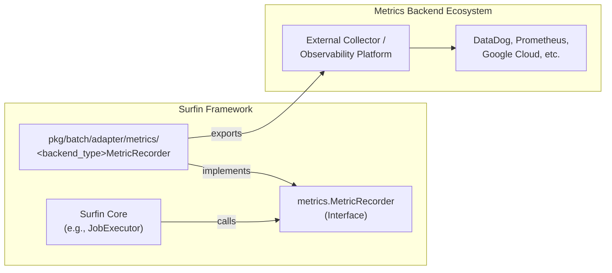

# Metrics Adapter の抽象設計

## 1. はじめに

*   本ドキュメントは、Surfin バッチフレームワークにおける Metrics Adapter の導入に関する高レベルな設計思想と目的を記述します。
*   具体的な実装の詳細には踏み込まず、アーキテクチャ上の位置づけ、役割、および主要な考慮事項に焦点を当てます。

## 2. 背景

*   Surfin バッチフレームワークは、ジョブやステップの実行状況を把握するためにメトリクス収集の仕組みを内包しています。
*   現在、このメトリクス収集は `metrics.MetricRecorder` インターフェースによって抽象化されていますが、具体的なバックエンドへの連携は限定的です。
*   現代のシステム運用において、アプリケーションの健全性を監視し、問題発生時に迅速に原因を特定するためには、メトリクス、トレース、ログといった「オブザーバビリティ」の確保が不可欠です。
*   Metrics Adapter は、`metrics.MetricRecorder` インターフェースを介して、様々なオブザーバビリティバックエンドへのデータ収集、処理、エクスポートを可能にする抽象化レイヤーを提供します。
*   このアダプターの導入により、Surfin バッチフレームワークが生成する豊富な実行メトリクスを、OpenTelemetry のような標準的なプロトコルや、各プラットフォーム固有のクライアントを介して、様々なオブザーバビリティプラットフォーム（例: DataDog, Prometheus, Google Cloud Monitoring, AWS CloudWatch など）に柔軟に連携させることを目指します。

## 3. Metrics Adapter の目的と役割

Metrics Adapter の主な目的と役割は以下の通りです。

*   **`metrics.MetricRecorder` インターフェースの実装**:
    *   Surfin フレームワークが提供する汎用的なメトリクス記録インターフェース (`pkg/batch/core/metrics.MetricRecorder`) を、具体的なメトリクスバックエンドの SDK（例: OpenTelemetry SDK、Prometheus クライアントライブラリなど）を用いて実装します。
*   **内部イベントの標準化とエクスポート**:
    *   Surfin 内部で発生するジョブ、ステップ、アイテムレベルのイベント（開始、終了、読み込み、書き込み、スキップ、リトライなど）を、各メトリクスバックエンドの標準的なメトリクス形式（カウンター、ヒストグラムなど）に変換し、設定された外部コレクターまたはバックエンドへエクスポートします。
*   **オブザーバビリティの拡張性確保**:
    *   特定の監視ツールに依存することなく、将来的に様々なオブザーバビリティプラットフォームへの連携を可能にする基盤を提供します。

## 4. アーキテクチャ上の位置づけ

Metrics Adapter は、Surfin フレームワークの `adapter` レイヤーに位置づけられます。

*   **パッケージ**: `pkg/batch/adapter/metrics` 配下に、各メトリクスバックエンドに対応するサブパッケージ（例: `pkg/batch/adapter/metrics/opentelemetry`）として導入されます。
*   **責務の分離**: コアフレームワーク (`pkg/batch/core`) はメトリクス収集の抽象インターフェースのみを認識し、具体的なメトリクスバックエンドの実装詳細からは分離されます。これにより、コアフレームワークのクリーンさと保守性が保たれます。
*   **アダプターパターン**: 外部システム（この場合は各メトリクスバックエンドのエコシステム）との連携をカプセル化するアダプターパターンを適用します。

## 5. 主要な機能と責務

*   **メトリクスバックエンド SDK の初期化**: アプリケーション起動時に、選択されたメトリクスバックエンドの SDK（例: OpenTelemetry SDK、Prometheus クライアントライブラリなど）を適切に初期化し、ライフサイクル管理（シャットダウン処理を含む）を行います。
*   **メトリクス変換ロジック**: `metrics.MetricRecorder` の各メソッド呼び出しを、対応するメトリクスバックエンドの操作（カウンターのインクリメント、ヒストグラムへの値の記録など）に変換します。
*   **属性（Attributes/Labels）の付与**: ジョブ名、ステップ名、ステータス、エラー理由などのコンテキスト情報を、各メトリクスバックエンドの属性またはラベルとしてメトリクスに付与し、分析の粒度を高めます。
*   **設定による制御**: アプリケーションの設定ファイルを通じて、各メトリクスバックエンドのエクスポート先（エンドポイント、プロトコルなど）や、メトリクス収集の有効/無効を制御できるようにします。

## 6. メリット

*   **ベンダーロックインの回避**: `metrics.MetricRecorder` インターフェースとアダプターパターンを採用することで、特定の監視ツールへの依存を排除し、将来的なツール変更やマルチクラウド環境への対応が容易になります。OpenTelemetry のような標準プロトコルに準拠したアダプターを導入することで、このメリットをさらに強化します。
*   **統合オブザーバビリティ**: OpenTelemetry のような統合的なオブザーバビリティフレームワークに対応したアダプターを導入することで、将来的にトレースやログの収集にも連携し、メトリクス、トレース、ログを横断的に関連付けた統合的なオブザーバビリティを実現する基盤となります。
*   **標準化された計装**: OpenTelemetry のような業界標準の計装ライブラリを使用するアダプターを導入することで、コミュニティの恩恵を受け、保守性や相互運用性が向上します。
*   **柔軟なデプロイメント**: バッチ処理の特性に合わせて、Push 型のエクスポートモデルを基本とすることで、効率的なメトリクス収集が可能です。

## 7. 考慮事項

*   **パフォーマンスへの影響**: メトリクス収集はアプリケーションのパフォーマンスに影響を与える可能性があるため、非同期処理（`AsyncMetricRecorderWrapper` の活用）やバッファリングを適切に利用し、オーバーヘッドを最小限に抑える設計とします。
*   **設定の複雑性**: 各メトリクスバックエンドの設定項目は多岐にわたるため、ユーザーが容易に設定できるよう、必要な項目を厳選し、デフォルト値を適切に設定します。
*   **エラーハンドリング**: メトリクスエクスポート時のエラー（ネットワーク障害など）が発生した場合でも、アプリケーションの主要な処理が中断されないよう、堅牢なエラーハンドリングを実装します。
*   **既存のメトリクス実装との共存**: 既存の Prometheus 向けメトリクス収集機能（`pkg/batch/infrastructure/metrics/prometheus_recorder.go`）や簡易的なロガーベースの実装（`pkg/batch/listener/metrics/recorder.go`）との切り替えや共存を考慮し、Fx の依存性注入メカニズムを最大限に活用します。
