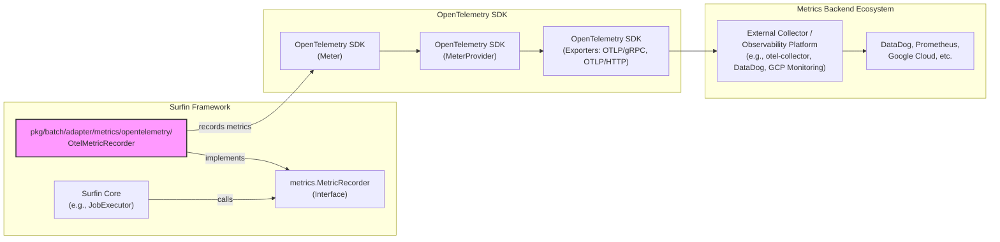

# OpenTelemetry Metrics Adapter の設計

## 1. はじめに

* 本ドキュメントは、Surfin バッチフレームワークにおける OpenTelemetry Metrics Adapter (`pkg/batch/adapter/metrics/opentelemetry`)の設計について記述します。
* このアダプターは、`pkg/batch/core/metrics.MetricRecorder` インターフェースの OpenTelemetry Go SDK を用いた具体的な実装を提供し、Surfin が生成するメトリクスを OpenTelemetry Protocol(OTLP) 互換の様々なバックエンドへエクスポートすることを可能にします。

## 2. アーキテクチャ上の位置づけ

OpenTelemetry Metrics Adapter は、Surfin フレームワークの `adapter` レイヤーに位置し、コアフレームワークと外部のオブザーバビリティシステムとの橋渡しをします。

*   **責務**:
    *   `core/metrics.MetricRecorder` インターフェースの具体的な実装を提供し、アプリケーションの設定に基づいて OpenTelemetry `MeterProvider` を初期化し、メトリクスを外部システムにエクスポートします。
*   **設定との連携**:
    *   `application.yaml` の `surfin.adapter.metrics` 配下の設定を読み込み、エクスポート先の種類（OTLP/gRPC, OTLP/HTTP など）や接続情報を動的に構成します。

## 3. 主要コンポーネント

### pkg/batch/adapter/metrics/opentelemetry/config.go

 * 役割:
     * application.yaml から読み込む OpenTelemetry エクスポーターの設定構造を定義します。
 * 詳細:
     * OTLPExporterConfig:
         * OTLP (OpenTelemetry Protocol) を使用するエクスポーター（gRPC または HTTP）の設定を保持します。
         * ホスト、ポート、プロトコル、認証ヘッダー、タイムアウト、圧縮方式、TLS 設定などが含まれます。
     * PrometheusPushgatewayConfig:
         * Prometheus Pushgateway へのエクスポートに関する設定を保持します。
         * これは OpenTelemetry SDK の直接の範囲外ですが、設定の柔軟性を示すために定義されます。

### pkg/batch/adapter/metrics/opentelemetry/recorder.go

 * 役割:
     * pkg/batch/core/metrics.MetricRecorder インターフェースの OpenTelemetry Go SDK を用いた具体的な実装を提供します。
 * 詳細:
     * OtelMetricRecorder 構造体が MetricRecorder インターフェースを実装します。
     * 内部で go.opentelemetry.io/otel/metric パッケージの Meter を使用し、カウンター (Int64Counter) やヒストグラム (Float64Histogram) などの OpenTelemetry メトリクスインストゥルメントを定義します。
     * RecordJobStart, RecordStepEnd, RecordItemRead などの各メソッドは、対応する OpenTelemetry メトリクスインストゥルメントを呼び出し、バッチ実行のコンテキスト情報（ジョブ名、ステップ名、ID、ステータスなど）を OpenTelemetry の属性 (attribute.KeyValue) として付与します。
     * RecordDuration メソッドは、指定された操作の実行時間をヒストグラムとして記録します。

### pkg/batch/adapter/metrics/opentelemetry/provider.go

 * 役割:
     * OpenTelemetry MeterProvider の初期化とライフサイクル管理を行い、MetricRecorder インスタンスを生成して Fx (Go.uber.org/fx) の依存性注入コンテナに提供します。
 * 詳細:
     * NewMetricRecorderProvider 関数が、application.yaml の surfin.adapter.metrics 設定を読み込みます。
     * 設定された各エクスポーター（type: otlp のもの）に対して、go.opentelemetry.io/otel/exporters/otlp/otlpmetric/otlpmetricgrpc または otlpmetrichttp を使用して OpenTelemetry エクスポーターインスタンスを動的に作成します。
     * 複数のエクスポーターが設定されている場合、metric.NewMultiExporter を使用してそれらを統合します。
     * metric.NewPeriodicReader を使用して、メトリクスを定期的にエクスポートするメカニズムを設定します。
     * metric.NewMeterProvider を使用して MeterProvider を構築し、アプリケーションのリソース属性（サービス名、バージョンなど）を設定します。
     * OtelMetricRecorder のインスタンスを生成し、MeterProvider を渡します。
     * アプリケーション終了時に MeterProvider を適切にシャットダウンするためのフック (ShutdownMeterProvider) を提供します。
     * 設定が有効でない場合やエクスポーターが設定されていない場合は、core/metrics.NoopMetricRecorder (何もしない実装) を返します。

### pkg/batch/adapter/metrics/opentelemetry/module.go

 * 役割:
     * Fx (Go.uber.org/fx) モジュールとして、OpenTelemetry Metrics Adapter のコンポーネントをアプリケーションの依存性注入グラフに登録します。
 * 詳細:
     * fx.Provide(NewMetricRecorderProvider):
         * NewMetricRecorderProvider 関数をプロバイダーとして登録し、core/metrics.MetricRecorder インターフェースの実装と MeterProviderHolder を提供します。
     * fx.Invoke と fx.Hook:
         * Fx のライフサイクル管理機能を利用し、アプリケーションのシャットダウン時に MeterProvider が確実にクリーンアップされるように ShutdownMeterProvider 関数を OnStop フックに登録します。

## 4. 考慮事項

 * OpenTelemetry SDK の設定:
     * MeterProvider の初期化時に、サービス名、バージョンなどのリソース属性を適切に設定することが重要です。
 * エクスポート間隔:
     * PeriodicExportingMetricReader のエクスポート間隔は、メトリクスの鮮度とシステム負荷のバランスを考慮して設定する必要があります。
 * エラーハンドリング:
     * エクスポーターの初期化やメトリクスエクスポート中に発生するエラーは、適切にロギングし、アプリケーションの主要な処理を妨げないように設計します。
 * Prometheus Pushgateway:
     * OpenTelemetry Go SDK は Prometheus Pushgateway を直接サポートしていません。
     * application.yaml の設定例には含まれますが、実装上は OpenTelemetry Collector を介して Pushgateway に送るのが推奨されるアプローチとなります。(このため、実装スコープ外となる。) 
 * パフォーマンス:
     * メトリクス収集はアプリケーションのパフォーマンスに影響を与える可能性があるため、OpenTelemetry SDK のバッファリングや非同期処理の特性を理解し、適切に利用します。
