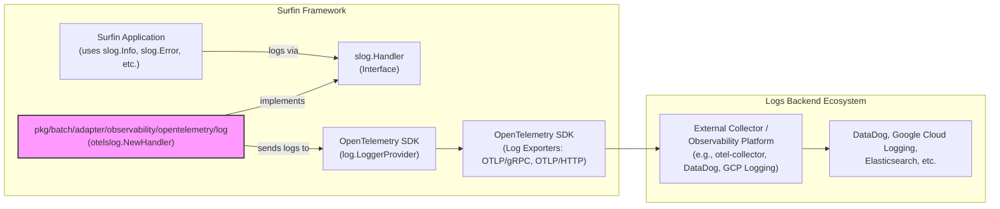

# OpenTelemetry Logs Adapter の設計

## 1. はじめに

本ドキュメントは、Surfin バッチフレームワークにおける OpenTelemetry Logs Adapter の導入に関する設計思想と目的を記述します。具体的な実装の詳細には踏み込まず、アーキテクチャ上の位置づけ、役割、および主要な考慮事項に焦点を当てます。

Surfin バッチフレームワークは現在、標準ライブラリの `log/slog` を用いて構造化ログを出力しています。このログは主にアプリケーションの実行状況やエラー情報を開発者や運用者に提供するために利用されています。しかし、これらのログは通常、ローカルファイルや標準出力に限定されており、集中ログ管理システムへの連携には別途エージェントや転送メカニズムが必要となります。

OpenTelemetry は、メトリクス、トレース、ログといったオブザーバビリティデータを収集、処理、エクスポートするためのベンダーニュートラルな標準を提供します。本アダプターの導入により、Surfin が出力するログを OpenTelemetry の標準形式に変換し、OTLP (OpenTelemetry Protocol) を介して様々なオブザーバビリティプラットフォーム（例: Google Cloud Logging, Elasticsearch, DataDog, Splunk など）に柔軟に連携させることを目指します。

## 2. 背景

Surfin バッチフレームワークは、既に OpenTelemetry を用いたメトリクスとトレースの収集・エクスポート機能を提供しています。これにより、ジョブやステップの実行状況を数値データや分散トレースとして可視化できるようになりました。

しかし、オブザーバビリティの三本柱であるメトリクス、トレース、ログを統合的に扱うことで、より迅速な問題特定と根本原因分析が可能になります。特に、エラー発生時にはトレースから関連するログを、ログから関連するトレースやメトリクスを辿ることで、状況把握の効率が飛躍的に向上します。

現在の `slog` によるログ出力は、その構造化された性質から OpenTelemetry Logs との親和性が高いです。このアダプターは、`slog` のログレコードを OpenTelemetry のログレコードに変換し、既存の OpenTelemetry パイプラインに統合することで、Surfin のオブザーバビリティ機能を完成させることを目的とします。

## 3. OpenTelemetry Logs Adapter の目的と役割

OpenTelemetry Logs Adapter の主な目的と役割は以下の通りです。

*   **`slog` ログの OpenTelemetry 形式への変換**: `slog` で出力されるログレコード（レベル、メッセージ、属性など）を OpenTelemetry のログデータモデルに準拠した形式に変換します。
*   **OTLP を介したログのエクスポート**: 変換されたログデータを OTLP を使用して設定された外部コレクターまたはバックエンドへエクスポートします。
*   **既存のオブザーバビリティ機能との統合**: メトリクスおよびトレースと同様に、共通の `ObservabilityConfig` を利用してログのエクスポート設定を管理し、一元的なオブザーバビリティ設定を実現します。
*   **ベンダーロックインの回避**: OpenTelemetry 標準に準拠することで、特定のログ管理ツールへの依存を排除し、将来的なツール変更やマルチクラウド環境への対応を容易にします。

## 4. アーキテクチャ上の位置づけ

OpenTelemetry Logs Adapter は、Surfin フレームワークの `adapter` レイヤーに位置づけられ、`pkg/batch/adapter/observability/opentelemetry/log` という新しいパッケージとして導入されます。

このアダプターは、`slog` の `Handler` インターフェースを実装し、`slog` がログを出力する際にそのログレコードを受け取ります。受け取ったログレコードは OpenTelemetry の `Logger` を介して `LoggerProvider` に送られ、設定されたエクスポーターによって外部システムに転送されます。



## 5. 主要コンポーネント

### pkg/batch/adapter/observability/config/config.go の変更

既存の `CommonExporterConfig` に、ログエクスポート用の設定を追加します。

```go
// CommonExporterConfig defines the common configuration for any observability exporter.
// It includes general settings like type and enabled status, and optional
// nested configurations for trace, metrics, and log specific OTLP settings.
type CommonExporterConfig struct {
	Type    string              `yaml:"type"`              // Type of the exporter (e.g., "otlp", "prometheus").
	Enabled bool                `yaml:"enabled"`           // Whether this exporter is enabled.
	Trace   *OTLPExporterConfig `yaml:"trace,omitempty"`   // OTLP configuration specific to traces.
	Metrics *OTLPExporterConfig `yaml:"metrics,omitempty"` // OTLP configuration specific to metrics.
	Log     *OTLPExporterConfig `yaml:"log,omitempty"`     // OTLP configuration specific to logs. <--- 追加
}
```

### pkg/batch/adapter/observability/opentelemetry/log/config/config.go

*   **役割**: OpenTelemetry Logs エクスポーターの設定構造を定義します。
*   **詳細**:
    *   `LogExportersConfig` 構造体を定義し、`map[string]config.CommonExporterConfig` として、ログエクスポートに特化した設定を保持します。これはメトリクスやトレースの `config.go` と同様のパターンです。

### pkg/batch/adapter/observability/opentelemetry/log/provider.go

*   **役割**: OpenTelemetry `log.LoggerProvider` の初期化とライフサイクル管理を行い、Fx (Go.uber.org/fx) の依存性注入コンテナに提供します。
*   **詳細**:
    *   `NewLoggerProvider` 関数が、`ObservabilityConfig` からログ関連の設定を読み込みます。
    *   設定された各エクスポーター（`type: otlp` かつ `Log` フィールドが設定されているもの）に対して、`go.opentelemetry.io/otel/exporters/otlp/otlplog/otlploggrpc` または `otlploghttp` を使用して OpenTelemetry ログエクスポーターインスタンスを動的に作成します。
    *   `log.NewBatchProcessor` を使用して、ログをバッチ処理し、非同期でエクスポートするメカニズムを設定します。
    *   `log.NewLoggerProvider` を使用して `LoggerProvider` を構築し、アプリケーションのリソース属性（サービス名、バージョンなど）を設定します。
    *   アプリケーション終了時に `LoggerProvider` を適切にシャットダウンするためのフック (`fx.Lifecycle.OnStop`) を提供します。
    *   設定が有効でない場合やエクスポーターが設定されていない場合は、`log.NewLoggerProvider()` (No-op provider) を返します。

### pkg/batch/adapter/observability/opentelemetry/log/module.go

*   **役割**: Fx (Go.uber.org/fx) モジュールとして、OpenTelemetry Logs Adapter のコンポーネントをアプリケーションの依存性注入グラフに登録します。
*   **詳細**:
    *   `NewLogExportersConfigFromObservabilityConfig` 関数を定義し、`ObservabilityConfig` から有効なログエクスポーター設定をフィルタリングして提供します。
    *   `fx.Provide(NewLoggerProvider)`: `LoggerProvider` を提供します。
    *   `fx.Provide(func(lp *log.LoggerProvider) slog.Handler { return otelslog.NewHandler(lp) })`: `LoggerProvider` から `otelslog.NewHandler` を使用して `slog.Handler` を作成し、提供します。
    *   `fx.Invoke(func(handler slog.Handler) { slog.SetDefault(slog.New(handler)) })`: アプリケーション起動時に、提供された `slog.Handler` をデフォルトのロガーとして設定します。これにより、既存の `slog` の呼び出しが OpenTelemetry Logs パイプラインにルーティングされるようになります。

### pkg/batch/adapter/observability/module.go の変更

既存の `observability.Module` に、新しく作成する OpenTelemetry Logs モジュールを追加します。

```go
// Module is the Fx module for observability components.
// It provides the ObservabilityConfig to the Fx application context
// and includes sub-modules for OpenTelemetry metrics, tracing, and logs.
var Module = fx.Options(
	fx.Provide(NewObservabilityConfigFromAppConfig),
	metricsOtel.Module, // Includes the OpenTelemetry metrics module.
	traceOtel.Module,   // Includes the OpenTelemetry trace module.
	logOtel.Module,     // Includes the OpenTelemetry logs module. <--- 追加
)
```

## 6. 考慮事項

*   **パフォーマンスへの影響**: ログの量が多い場合、ログの変換とエクスポートがアプリケーションのパフォーマンスに影響を与える可能性があります。`log.NewBatchProcessor` によるバッチ処理と非同期エクスポートはオーバーヘッドを最小限に抑えるのに役立ちますが、ログレベルの調整やサンプリングの導入も検討が必要です。
*   **設定の複雑性**: OpenTelemetry の設定項目は多岐にわたるため、ユーザーが容易に設定できるよう、必要な項目を厳選し、デフォルト値を適切に設定します。特に、`application.yaml` での `log` セクションの記述例を明確にする必要があります。
*   **エラーハンドリング**: ログエクスポート時のエラー（ネットワーク障害など）が発生した場合でも、アプリケーションの主要な処理が中断されないよう、堅牢なエラーハンドリングを実装します。エクスポーターのエラーは通常、内部的に処理され、ログとして出力されます。
*   **既存の `slog` 設定との共存**: `slog.SetDefault` を使用することで、アプリケーション全体で OpenTelemetry 対応のハンドラが適用されます。もし、特定のコンポーネントで異なる `slog.Handler` を使用したい場合は、そのコンポーネント内で `slog.New` を使用して独自のロガーインスタンスを作成し、Fx で提供される `slog.Handler` を利用しないようにする必要があります。
*   **ログレベルのマッピング**: `slog` のログレベル（DEBUG, INFO, WARN, ERROR）は、OpenTelemetry のログレベル（SeverityNumber）に適切にマッピングされます。`otelslog` ブリッジがこのマッピングを自動的に行います。
*   **リソース属性とスコープ属性**: `LoggerProvider` の初期化時に `resource.WithAttributes` でサービス名などのリソース属性を設定します。また、`slog` の `With` メソッドで追加された属性は、OpenTelemetry のログレコードの属性として自動的に含まれます。
*   **JSON出力との関係**: `slog` の JSON 出力は、コンソールやファイルへの可読性を高めるためのフォーマットです。OpenTelemetry Logs は、この JSON 形式を直接転送するのではなく、`slog` が持つ構造化されたログデータ（キーと値のペア）を OpenTelemetry のデータモデルに変換し、OTLP (Protobuf) 形式で転送します。これにより、ログの構造と内容は保持され、バックエンドで適切に解析・表示されます。
